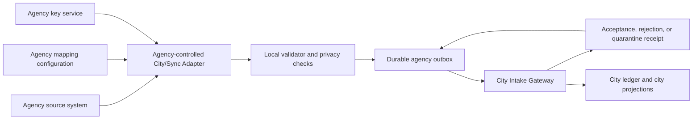

# City/Sync Agency Node Self-Service Integration Guide

**Status:** Draft target specification  
**Audience:** Government program owners, information technology teams, security teams, data stewards, records officers, and implementation partners  
**Purpose:** Explain how an agency can configure, test, and operate its own connection to a City/Sync City Network without giving City/Sync direct access to the agency's database or requiring City/Sync personnel to perform the agency's field mapping.

> **Current implementation notice**
>
> City/Sync does not yet provide the complete Agency Integration Portal, packaged adapter, conformance suite, or production City Intake Gateway described in this guide. This document defines the target self-service product and protocol that should be built. It is not a claim that the present application is ready for agency production use.

## 1. Executive summary

An agency does not need to replace its existing database with Turso, use the same table names as City/Sync, or allow City/Sync to query its internal systems.

The agency runs a City/Sync Adapter inside an environment it controls. The agency configures that adapter to:

1. Read an approved subset of data from its existing system.
2. Translate local terms into the standard City/Sync event vocabulary.
3. Remove information the City Network does not need.
4. Validate each event against a published schema.
5. Sign the event with the agency's registered key.
6. Submit it to the City Intake Gateway.
7. Retain the city's acceptance or rejection receipt.

City/Sync publishes the software, schemas, test suite, documentation, and support materials. The agency owns its configuration, credentials, data selection, internal approvals, and operations.

Self-service does **not** mean ungoverned. An agency can configure its integration without City/Sync doing the work, but a city or authorized City Network operator must still approve the agency as a trusted submitting organization.

## 2. Responsibility model

| Responsibility | Agency | City/Sync | City Network operator |
|---|---:|---:|---:|
| Inventory source systems and data | Primary | Guidance | Review if required |
| Decide what the agency is authorized to share | Primary | Protocol limits | City policy |
| Map agency fields to City/Sync events | Primary | Mapping tools and examples | No routine involvement |
| Host and operate the adapter | Primary, unless managed hosting is selected | Optional managed service | No routine involvement |
| Protect source-system credentials | Primary | Never receives them | Never receives them |
| Publish schemas and protocol versions | Review | Primary | Approves supported versions |
| Validate schemas and signatures | Local preflight | Reference implementation | Production gateway |
| Approve an agency node | Submit evidence | Technical conformance result | Primary |
| Accept or reject civic events | Receive receipts | Gateway software | Policy authority |
| Maintain internal records and evidence | Primary | No access by default | No access by default |
| Maintain city ledger and acceptance history | Reconcile receipts | Protocol tooling | Primary |

## 3. Reference architecture



The City Intake Gateway never needs a direct database connection to the agency's system. The adapter initiates outbound communication to the gateway.

## 4. Supported integration patterns

An agency selects the least complicated pattern its existing system supports.

### 4.1 Native City/Sync Organization Node

Best for an organization adopting City/Sync as its volunteer-management system.

- The standard node already produces compatible events.
- The agency configures its identity provider, policies, keys, and city connection.
- No field-by-field source mapping is normally required.

### 4.2 REST API integration

Best for a modern agency platform with a supported API.

- The adapter periodically requests changed records or receives a source webhook.
- The agency maps API fields to City/Sync fields.
- The adapter maintains a cursor so it does not repeatedly process the same records.

### 4.3 Database read-replica integration

Best when the agency permits controlled database reporting access but does not have a suitable API.

- The adapter receives read-only access to an agency-controlled view or replica.
- The agency creates views exposing only approved fields.
- The adapter must never receive broad write access to the source database.

### 4.4 Scheduled batch integration

Best for legacy systems that can export CSV, JSON, or newline-delimited JSON.

- The agency produces an export on an approved schedule.
- The adapter validates, transforms, and signs each record.
- Processed files are moved to a controlled archive or destroyed according to agency policy.

### 4.5 Message bus or event-stream integration

Best for agencies already using enterprise messaging.

- The adapter subscribes to an approved topic or queue.
- Source messages are translated to City/Sync events.
- The agency's original message identifier becomes part of the idempotency record.

### 4.6 Manual secure submission

Best only for pilots and low-volume programs.

- An authorized agency user uploads a signed batch through the Integration Portal.
- The same schema, validation, and receipt rules apply.
- Manual entry should not become the long-term path for high-volume activity.

## 5. Self-service onboarding process

### Step 1: Establish agency ownership

The agency designates:

- Executive or program sponsor
- Integration owner
- Security contact
- Privacy contact
- Records-management contact
- Operational contact
- Backup contact

The agency also identifies who may approve mappings, rotate keys, submit events, review rejected events, and suspend the integration.

### Step 2: Define the use case

Document:

- Programs included in the integration
- Types of civic work included
- Intended participants
- Expected event volume
- Information handled
- Legal authority for sharing it
- Prohibited information
- Records-retention requirements
- Required availability and recovery time

An agency should complete its own security categorization and privacy review before production use. Federal agencies ordinarily categorize information-system impact using FIPS 199 and select controls through their applicable Risk Management Framework process.

### Step 3: Register the organization and node

Through the proposed Agency Integration Portal, the agency supplies:

- Legal organization name
- City Network
- Stable organization identifier
- Node display name
- Integration pattern
- Production and sandbox contact information
- Supported protocol and schema versions
- Public signing key
- Expected submission source
- Data-residency declaration
- Security and incident-response contacts

The agency does **not** enter its database password or source-system credentials into the City/Sync portal.

### Step 4: Install the adapter

The target distribution should support:

- A signed container image
- A versioned command-line package
- A software bill of materials
- Published checksums and signatures
- Deployment examples for common cloud and on-premises environments
- Upgrade and rollback instructions

The adapter should be deployed inside the agency's environment and use an outbound-only connection to the City Intake Gateway wherever practical.

### Step 5: Connect the source system

The agency selects a reusable connector and creates local credentials:

- PostgreSQL
- Microsoft SQL Server
- Oracle
- SQLite or libSQL
- REST API
- CSV or JSON batch
- Message queue

Credentials are stored in the agency's secret-management system. They must not be placed in source control, container images, mapping files, or City/Sync records.

### Step 6: Map agency concepts

The portal or local mapping editor presents City/Sync concepts on one side and source fields on the other.

Example:

| City/Sync concept | Agency source field |
|---|---|
| Participant reference | `volunteer_number` |
| Opportunity template | `activity_code` |
| Published shift | `event_assignment_id` |
| Shift start | `scheduled_start_utc` |
| Shift end | `scheduled_end_utc` |
| Completion outcome | `supervisor_disposition` |
| Verifier | `approving_staff_id` |

Mappings may include transformations such as:

- Convert local time to UTC.
- Translate `P`, `A`, and `C` into `verified`, `no_show`, and `cancelled`.
- Convert minutes into a standard duration.
- Replace an internal person identifier with a City Network participant identifier.
- Remove free-text notes before city publication.

### Step 7: Select publishable event types

The agency explicitly enables the event types it is authorized to submit. Initial profiles should be narrow.

Recommended starting events:

- `SHIFT_PUBLISHED`
- `SHIFT_UPDATED`
- `SHIFT_CANCELLED`
- `COMMITMENT_CREATED`
- `COMMITMENT_WITHDRAWN`
- `CHECK_IN_RECORDED`
- `COMPLETION_SUBMITTED`
- `CONTRIBUTION_VERIFIED`
- `NO_SHOW_RECORDED`
- `CORRECTION_ISSUED`

The agency should not submit a `CREDITS_MINTED` command. The city derives credit issuance from an accepted verification under city policy.

### Step 8: Configure privacy rules

The adapter uses an allowlist: only specifically authorized fields may leave the agency.

The following should be blocked by default:

- Passwords or authentication secrets
- Social Security numbers
- Driver's-license numbers or images
- Dates of birth unless specifically authorized
- Home addresses
- Phone numbers and email addresses
- Minor consent forms
- Waiver signatures and full waiver documents
- Medical or disability information
- Background-check contents
- Private messages
- Internal volunteer reflections
- Unstructured case notes

Where evidence is required, submit a private evidence reference and cryptographic hash rather than the sensitive evidence itself.

### Step 9: Configure signing and transport security

Each node receives a distinct identity and signing key.

Minimum target requirements:

- TLS 1.2 or later, with TLS 1.3 preferred
- OAuth 2.0 client credentials or mutual TLS for node authentication
- A separate digital signature on every event or signed batch
- FIPS-compatible algorithms for government profiles
- Private keys stored in an approved key-management system
- Key rotation and emergency revocation
- Least-privilege submission scopes
- No shared credentials between agencies or environments

Network location alone must not establish trust. Every submission is authenticated, authorized, validated, and checked for replay.

### Step 10: Run local preflight validation

Before sending data, the agency runs the conformance tool locally. It checks:

- Required fields
- Field types and formats
- Allowed event vocabulary
- Protocol and schema versions
- Timestamp validity
- Sequence continuity
- Previous-event hash
- Event hash
- Digital signature
- Duplicate event IDs
- Prohibited fields
- Valid organization, authority, and policy references

Local validation gives the agency actionable errors without sending source data to City/Sync.

### Step 11: Test in the City/Sync sandbox

The agency submits synthetic data only. The conformance suite tests at least:

1. Valid event acceptance
2. Invalid schema rejection
3. Invalid signature rejection
4. Revoked-key rejection
5. Duplicate event idempotency
6. Out-of-order event handling
7. Retry after temporary failure
8. Prohibited-field rejection
9. Unknown policy handling
10. Correction of a prior event
11. Key rotation
12. Export and restoration

The agency receives a machine-readable conformance report. Routine technical approval should be automated when all required tests pass.

### Step 12: Request production activation

The agency submits:

- Completed conformance report
- Authorized event profile
- Public signing key
- Approved privacy mapping
- Operational and security contacts
- Applicable agreement or memorandum
- Confirmation of internal authorization

The City Network operator approves or rejects participation. City/Sync personnel should not need to enter the agency's mappings or handle its source credentials.

### Step 13: Reconcile the first production events

For an agreed observation period, the agency compares:

- Events placed in the local outbox
- Events delivered
- City acceptance receipts
- Rejections and quarantine decisions
- City ledger sequence references
- Source-system outcomes

Production status becomes normal only after the agency and city agree that reconciliation is correct.

## 6. Standard event envelope

Every real-time event and batch item should use the same logical envelope.

```json
{
  "protocol": "citysync",
  "protocolVersion": "1.0",
  "schemaVersion": "1.0",
  "eventId": "agency-generated-unique-id",
  "eventType": "CONTRIBUTION_VERIFIED",
  "occurredAt": "2026-09-03T17:15:00Z",
  "source": {
    "organizationId": "org:riverside-food-bank",
    "nodeId": "node:production-1",
    "sequence": 842,
    "previousHash": "previous-organization-event-hash",
    "sourceRecordId": "agency-internal-reference"
  },
  "authority": {
    "actorId": "agency-pseudonymous-actor-reference",
    "delegationId": "delegation-reference",
    "role": "VERIFIER",
    "policyId": "verification-policy",
    "policyVersion": "2.1"
  },
  "subject": {
    "cityParticipantId": "berkeley:participant-reference"
  },
  "publicFacts": {
    "shiftId": "shift-reference",
    "programId": "program-reference",
    "verifiedMinutes": 180,
    "outcome": "verified"
  },
  "evidence": {
    "method": "staff-attestation",
    "privateEvidenceReference": "agency-retained-reference",
    "privateEvidenceHash": "evidence-hash"
  },
  "privacy": {
    "classification": "city-network",
    "containsDirectPersonalIdentifiers": false
  },
  "integrity": {
    "eventHash": "current-organization-event-hash",
    "keyId": "org:riverside-food-bank:key:3",
    "algorithm": "ES256",
    "signature": "signature-value"
  }
}
```

The formal schema should use precise requirements for canonicalization, hashing, signatures, maximum lengths, enumeration values, and date formats. An informal JSON example is not sufficient for production interoperability.

## 7. City response receipts

The gateway returns one of three outcomes.

### Accepted

The event passed technical and city-policy validation and was added to the city record.

### Rejected

The event cannot be accepted as submitted. The response contains a stable error code and safe human-readable explanation.

### Quarantined

The event is structurally valid but requires review—for example, because it refers to an unknown policy, has an unusual sequence gap, or conflicts with a prior record.

Example receipt:

```json
{
  "eventId": "agency-generated-unique-id",
  "status": "accepted",
  "citySequence": 192430,
  "acceptedAt": "2026-09-03T17:15:02Z",
  "cityPolicyVersion": "berkeley-intake:1.4",
  "cityReceiptHash": "receipt-hash"
}
```

The agency retains receipts and reconciles them with its outbox. A transport success response alone does not mean the civic event was accepted.

## 8. Corrections

The agency must not overwrite an already accepted city event.

It submits a correction containing:

- Original event ID
- Correcting event ID
- Correction type
- Human-readable reason
- Corrected fields
- Authority used
- Applicable policy
- New signature

The city preserves both the original and correction, then updates its current public projection.

## 9. Operations after activation

### Daily or continuous monitoring

The agency monitors:

- Pending outbox depth
- Oldest pending event
- Delivery failures
- Rejected and quarantined events
- Sequence gaps
- Signature failures
- Clock drift
- Schema-version warnings
- Expiring credentials
- Reconciliation differences

### Key management

The agency must document:

- Key owner
- Key storage
- Rotation interval
- Backup and recovery
- Emergency revocation
- Separation between sandbox and production
- Separation between signing and database credentials

### Incident response

If compromise is suspected, the agency should be able to:

1. Stop outbound delivery without losing queued events.
2. Revoke the affected node or key.
3. Notify the City Network security contact.
4. Preserve relevant logs.
5. Determine the last trusted organization sequence.
6. Correct or withdraw invalid submissions through append-only correction events.
7. Register a replacement key.
8. Resume from an agreed checkpoint.

### Protocol upgrades

- Protocol and schema versions are explicit.
- The gateway publishes supported and retirement dates.
- Agencies can test a new version in the sandbox before production.
- Breaking changes require a new major version.
- Old events remain understandable under their original schema.
- The adapter should support a controlled rollback during the transition period.

## 10. NIST-aligned implementation profile

NIST alignment is a documented risk-and-control practice, not a certificate attached to a database product.

The agency and City/Sync should map the integration to:

| Guidance | Application to the integration |
|---|---|
| NIST Cybersecurity Framework 2.0 | Govern, identify, protect, detect, respond, and recover across the full node lifecycle |
| NIST SP 800-53 Rev. 5 | Access control, audit and accountability, identification and authentication, communications protection, integrity, contingency planning, configuration management, privacy, acquisition, and supply-chain controls |
| NIST SP 800-207 | Authenticate and authorize each node and request without trusting network location |
| NIST SP 800-63-4 | Apply risk-based identity proofing, authentication, and federation to agency users |
| NIST SP 800-218 | Secure development, build, release, vulnerability, and software-supply-chain practices for the adapter and gateway |
| FIPS 199 | Categorize information and system impact for federal use cases |
| NIST OSCAL | Express system-security plans, implemented controls, assessment evidence, and continuous-monitoring information in machine-readable form |

Authoritative references:

- [NIST Cybersecurity Framework 2.0](https://www.nist.gov/publications/nist-cybersecurity-framework-csf-20)
- [NIST SP 800-53 Rev. 5](https://csrc.nist.gov/pubs/sp/800/53/r5/upd1/final)
- [NIST SP 800-207 Zero Trust Architecture](https://csrc.nist.gov/pubs/sp/800/207/final)
- [NIST SP 800-63-4 Digital Identity Guidelines](https://csrc.nist.gov/pubs/sp/800/63/4/final)
- [NIST SP 800-218 Secure Software Development Framework](https://csrc.nist.gov/pubs/sp/800/218/final)
- [FIPS 199](https://csrc.nist.gov/pubs/fips/199/final)
- [NIST OSCAL](https://csrc.nist.gov/Projects/Open-Security-Controls-Assessment-Language)

For an in-scope federal cloud service, the agency must also determine the applicable FedRAMP authorization path and authorize its particular use of the service. State, local, tribal, and international agencies may have different mandatory frameworks even when they voluntarily use NIST guidance.

## 11. Agency readiness checklist

### Governance

- [ ] Executive or program sponsor assigned
- [ ] Integration, security, privacy, records, and operational owners assigned
- [ ] Legal authority and agreement identified
- [ ] Authorized event types approved
- [ ] Records-retention schedule established
- [ ] Incident-notification procedure established

### Data

- [ ] Source systems inventoried
- [ ] Required fields mapped
- [ ] Prohibited fields blocked by allowlist
- [ ] Time, status, and identifier transformations tested
- [ ] Participant identity reconciliation method approved
- [ ] Evidence remains under appropriate agency custody

### Security

- [ ] Sandbox and production credentials separated
- [ ] Private keys stored in an approved key service
- [ ] Least-privilege source access established
- [ ] Transport encryption configured
- [ ] Event signing configured
- [ ] Key rotation and revocation tested
- [ ] Adapter logs protected and retained
- [ ] Dependency and container verification enabled

### Reliability

- [ ] Durable outbox configured
- [ ] Retry and idempotency tested
- [ ] Duplicate and out-of-order submissions tested
- [ ] Backup and restore tested
- [ ] Reconciliation report reviewed
- [ ] Monitoring and alerting connected to agency operations
- [ ] Recovery checkpoint documented

### Activation

- [ ] Local conformance suite passed
- [ ] Sandbox conformance suite passed
- [ ] Synthetic end-to-end event accepted
- [ ] Production organization and node approved
- [ ] First production events reconciled
- [ ] Operational acceptance recorded

## 12. Offboarding or transfer

An agency can suspend or leave the network without losing its own records.

The process should include:

1. Stop new submissions.
2. Drain or deliberately cancel pending outbox events.
3. Reconcile all city receipts.
4. Produce a signed final organization checkpoint.
5. Export the organization journal, mappings, receipts, and retained evidence index.
6. Revoke node credentials and signing keys.
7. Update the organization registry.
8. Apply the agreed records-retention and destruction policy.

Previously accepted city records remain part of the city's historical ledger. Later corrections remain possible through an authorized successor or agreed administrative process.

## 13. What City/Sync must build to make this genuinely self-service

This guide becomes operational only after City/Sync provides:

1. A formal, versioned event vocabulary.
2. Published JSON Schemas and canonical hashing rules.
3. A packaged Agency Adapter.
4. Reusable source connectors.
5. A local mapping and privacy-rule editor.
6. A local validator.
7. A synthetic-data sandbox.
8. An automated conformance suite.
9. Organization and node registration.
10. Public-key registration and rotation.
11. A production City Intake Gateway.
12. Acceptance, rejection, and quarantine receipts.
13. Reconciliation and health dashboards.
14. Versioned city intake policies.
15. An OSCAL security-control package.
16. Export, transfer, suspension, and disaster-recovery procedures.

The product goal is straightforward:

> An authorized agency team should be able to connect its system, map its fields, test with synthetic data, prove conformance, and request activation without City/Sync ever receiving the agency's database credentials or manually configuring its integration.
