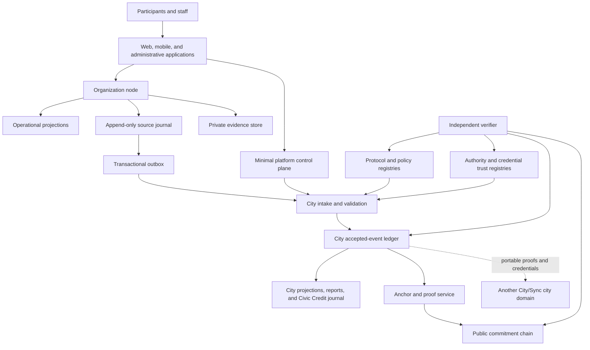
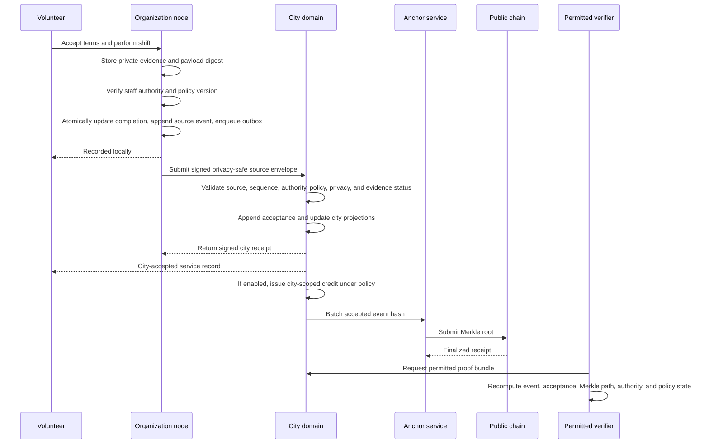

# City/Sync Backend Architecture Update

**Status:** Target architecture and implementation guide
**Version:** 0.2
**Date:** August 2026
**Companion document:** `deliverables/whitepaper/CitySync_Whitepaper.md`

This document describes the complete City/Sync backend as envisioned in the whitepaper. It is a technical target, not a claim that every component already exists. The final section maps the current prototype to this architecture and identifies the work required to close the gap.

The architecture begins with one distinction:

> An organization ledger records what an institution attests happened under its authority. A city ledger records which of those claims the city has accepted for shared civic purposes.

That separation creates local autonomy where records and evidence originate, and shared verification where claims cross institutional boundaries. It is the technical foundation for federated public administration.

---

## 1. Purpose and Scope

City/Sync is backend infrastructure for civic coordination, verifiable institutional records, machine-readable policy, portable credentials, evidence-derived reporting, and—where a city deliberately authorizes it—a local Civic Credit system.

The system begins with volunteer management because a volunteer shift contains the same primitives that recur throughout public administration:

- a person and an institution acting in defined roles;
- a published rule or set of terms;
- consent and disclosure;
- a commitment to perform an action;
- evidence that something occurred;
- an authorized attestation about that evidence;
- a correction or appeal path;
- a report or credential that may cross an institutional boundary; and
- an optional public benefit created by the verified contribution.

The backend must make this operating loop useful before it makes it distributed. Organizations need a reliable application, participants need an understandable process, and cities need evidence they can use. Cryptography strengthens the integrity of those relationships; it does not replace institutional judgment, law, or governance.

### 1.1 In scope

- participant, organization, authority, and city identities;
- organization-local operational data and append-only source journals;
- city-local intake, validation, accepted-event ledgers, and projections;
- versioned policies, delegated authority, consent, credentials, and evidence references;
- ordered and idempotent synchronization between organization and city domains;
- city-scoped Civic Credit issuance, redemption, reconciliation, and reporting;
- report manifests and independently verifiable proof bundles;
- privacy-safe Merkle commitments anchored to a public blockchain;
- open schemas, conformance tests, exports, and operator handoff; and
- eventual federation among independently governed city networks.

### 1.2 Explicit non-goals

- storing raw personal or administrative data on a public blockchain;
- asking participants to manage cryptocurrency wallets, seed phrases, or gas;
- treating a cryptographic record as proof that an underlying claim is true, lawful, or fair;
- placing discretionary public decisions inside opaque automation or smart contracts;
- creating a global Civic Credit currency or allowing credits to move between cities;
- replacing courts, regulators, ombudspeople, grievance procedures, or democratic authority;
- creating a shared SQLite database written to by multiple organizations; or
- making City/Sync the permanent, irreplaceable operator of a city's civic infrastructure.

---

## 2. Architectural Commitments

These invariants should survive changes in frameworks, vendors, databases, and blockchains.

1. **Local custody.** Private operational records and evidence remain in the organization or city domain that is authorized to hold them.
2. **City isolation.** Every city has an independent policy, event, credit, and governance domain. A failure or decision in one city cannot mutate another city's state.
3. **Append-only institutional history.** Committed events are corrected by later events, never silently edited in place.
4. **Atomic recording.** A material state change, its event, and its synchronization outbox entry are committed in one local transaction.
5. **Explicit authority.** Every consequential action identifies the delegation, office, or credential under which it was performed.
6. **Versioned rules.** Events reference the policy version that governed the action at the time it occurred.
7. **Privacy by placement.** Sensitive payloads stay private; cross-boundary envelopes contain only the minimum fields and cryptographic references required for their purpose.
8. **At-least-once delivery, exactly-once effect.** Messages may be retried, but stable identifiers and uniqueness constraints prevent duplicate state changes.
9. **Graceful degradation.** Local work continues during city-service or public-chain outages, with honest pending states and deterministic reconciliation.
10. **Verifiable claims with stated limits.** Every proof explains what was verified and what remains dependent on the issuer, evidence, policy, or human judgment.
11. **Replaceable operators.** Cities and organizations can export their records, keys or key-transition evidence, policy packages, and proofs into a compatible implementation.
12. **Proportional decentralization.** Distribution is introduced only where independent custody, cross-institutional coordination, or external verification produces measurable public value.

---

## 3. System Context



No single component is trusted to do every job. The organization node is closest to the work and private evidence. The city domain determines which claims enter shared civic state. The protocol layer makes independently developed implementations interpret those claims consistently. The public chain makes later alteration of committed batches detectable. Human institutions remain responsible for authorization, fact-finding, correction, and remedy.

---

## 4. Trust Boundaries and Sources of Authority

| Domain | Authoritative for | Not authoritative for |
|---|---|---|
| Participant account | Authentication, consent choices, presentations, correction requests | Whether an organization verifies work or a city accepts a claim |
| Organization node | Local operations, private evidence custody, source-event order, organization attestations | Citywide policy, another organization's records, public-chain finality |
| City domain | City membership, accepted shared events, city policies, Civic Credit state, city reports and reconciliation | The truth of undisclosed source evidence, another city's policy, a person's universal identity |
| Credential issuer | The bounded claim it is qualified and authorized to issue | The receiving institution's decision to accept that claim for a new purpose |
| Policy authority | Approval and effective status of a policy package | Facts that still require evidence or discretionary judgment |
| City/Sync steward | Reference software, protocol releases, conformance, security baselines | Statutory power or discretionary public decisions |
| Public blockchain | Existence, ordering, and finality of submitted commitments under that chain's rules | Semantic truth, legality, fairness, identity, or continuing availability of private data |
| Independent verifier | Reproduction of disclosed hashes, chains, authority states, policy versions, and inclusion proofs | Creation or modification of the underlying institutional record |

The word **accepted** is important. A city-ledger entry means that the submission passed a named validation profile and was admitted for a defined city purpose. It does not transform an institutional attestation into objective truth.

---

## 5. Logical Backend Layers

### 5.1 Application and API layer

The application layer serves participants, nonprofit staff, redeemers, city administrators, auditors, and public viewers. It owns interaction design, accessibility, localization, authentication flows, form validation, and human-readable explanations. It calls domain services rather than writing ledger tables directly.

All consequential commands pass through a common command boundary that:

1. authenticates the caller;
2. resolves the actor and active delegation;
3. loads the governing policy version;
4. validates the command and evidence requirements;
5. commits the projection change, source event, and outbox entry atomically; and
6. returns the event identifier and its current finality state.

Read APIs use projections optimized for the relevant screen or report. A user should not have to replay a ledger to view a schedule or balance.

### 5.2 Minimal platform control plane

The control plane exists to make a multi-city service operable without turning the platform database into the civic system of record. Its target responsibilities are:

- user authentication and account recovery;
- discovery of cities and public organizations;
- tenant and node routing;
- platform-wide software and schema version catalogues;
- organization onboarding before placement into a local domain;
- security operations and service health; and
- references to city and organization domains.

City balances, accepted city events, local policy decisions, and private organization evidence do not belong in the global control plane. Any temporary duplication used during migration must be labeled, reconciled, and removed when the local domain becomes authoritative.

### 5.3 Organization node

Each participating organization operates within an isolated logical database domain. “Local” means local to the institution's custody and failure boundary; it may be a managed encrypted database, a replicated SQLite-compatible service, or a sovereign node operated by the organization.

An organization node contains:

- operational projections for opportunities, onboarding, schedules, claims, messages, completion, waivers, credentials, and reports;
- an append-only source-event journal;
- private evidence and document metadata;
- consent, purpose, disclosure, retention, and redaction records;
- organization roles and scoped delegations;
- a cache of relevant city policies and trust registries;
- a transactional synchronization outbox;
- city receipts and reconciliation state; and
- backup, export, migration, and integrity metadata.

SQLite-compatible storage is appropriate because the organization domain has a bounded writer, needs inexpensive transactions, and should be exportable as a comprehensible artifact. It is not used as a peer-to-peer multiwriter database.

Two operating modes use the same protocol:

- **Managed organization node:** City/Sync provisions and monitors an isolated domain, manages backups and signing infrastructure under agreement, and provides full export and restore.
- **Sovereign organization node:** A qualified organization or local operator runs the reference node, controls its keys and evidence, and synchronizes signed event envelopes to the city.

### 5.4 City domain

Each city has a separately provisioned data, policy, ledger, key, and operating boundary. The city domain contains:

- city identity and configuration;
- organization membership and status;
- recognized authority and credential issuers;
- versioned policy packages and validation profiles;
- intake submissions, validation results, and receipts;
- the append-only city accepted-event ledger;
- city projections and aggregate views;
- the Civic Credit issuance and redemption journal, if enabled;
- report definitions, manifests, and reconciliation results;
- disputes, corrections, pauses, and administrative actions;
- Merkle batches, anchors, and proof material; and
- export, archive, replication, and operator-handoff state.

The database boundary is the primary tenant boundary. A city identifier remains in protocol envelopes and backups for defense in depth, but code must never rely on a `cityId` filter inside a shared substantive-state table as the only isolation control.

### 5.5 Protocol and verification services

These services allow multiple implementations to produce the same meaning and proof:

- schema and semantic event registry;
- JSON canonicalization and hashing;
- signature creation and verification;
- policy-package registry and compiler;
- credential formats and status resolution;
- trust-registry resolution;
- Merkle construction and inclusion proofs;
- report-manifest generation;
- proof-bundle construction and validation; and
- conformance test vectors and compatibility profiles.

They should be usable as libraries and as network services. Verification must remain possible without trusting the City/Sync-hosted interface.

### 5.6 Public commitment layer

The public chain receives only approved commitments and minimal metadata. During the initial architecture this means city-scoped Merkle roots over accepted event hashes. Later, a governed need may justify small registries for city identities or policy digests. Raw personal data, private evidence, messages, documents, and discretionary decisions never belong on the public chain.

The chain integration is an adapter. City/Sync's institutional promise cannot depend on one chain brand, RPC vendor, or wallet provider.

---

## 6. Data Model and Storage Boundaries

### 6.1 Organization-local storage

| Data class | Storage | Notes |
|---|---|---|
| Current workflow state | Organization projection tables | Optimized for application reads; reconstructable where events carry sufficient semantics |
| Source history | Organization `source_events` journal | Monotonic sequence and hash chain per organization |
| Private payloads | Encrypted organization database and/or evidence object store | Access and retention controlled locally |
| Evidence objects | Encrypted object storage with digest, media type, size, owner, and retention metadata | Object bytes are never placed in event envelopes |
| Synchronization | Organization outbox plus city receipts | Created in the same transaction as eligible source events |
| Local policy cache | Versioned package and digest | The city's authoritative published package remains independently retrievable |
| Credentials | Minimal claims, presentations, and status cache | Sensitive source documents remain with their qualified custodian |

### 6.2 City-local storage

| Data class | Storage | Notes |
|---|---|---|
| Submitted envelopes | Intake journal | Includes accepted, pending, quarantined, and rejected outcomes |
| Shared civic history | City `accepted_events` journal | City-assigned sequence and city hash chain |
| City current state | Projection tables | Membership, policy status, reports, Civic Credits, and other approved modules |
| Authority | Delegation and trust registries | Time-scoped, revocable, and purpose-scoped |
| Policies | Human source links, machine-readable packages, tests, and digests | Every event references the effective version |
| Reports | Definitions, manifests, exports, and proofs | Totals trace to accepted events and corrections |
| Anchors | Batch manifests, roots, receipts, and finality state | Separated by city and hash-suite version |

### 6.3 Public storage

The public commitment transaction may disclose only:

- protocol and hash-suite version;
- city commitment identifier or approved pseudonymous reference;
- city event sequence range or a privacy-reviewed batch reference;
- Merkle root;
- policy-registry digest where useful;
- previous-anchor reference;
- submission time and transaction receipt; and
- authorized anchoring key or contract identity.

Batch timing, size, and metadata are privacy-sensitive. A root can be safe while its surrounding metadata reveals participation patterns, so every public anchor profile requires privacy review.

### 6.4 Data classification

Every field and evidence object receives one of four default classes:

1. **Public:** deliberately publishable information, such as an organization profile or public policy source.
2. **Contextual:** shareable only inside a named organization, city, or program.
3. **Restricted:** personal, operational, or evidentiary data disclosed only to authorized roles for a defined purpose.
4. **High-risk:** screening records, protected client information, precise sensitive locations, legal documents, or similarly sensitive material requiring enhanced controls.

The classification determines storage location, envelope eligibility, log redaction, retention, proof disclosure, and incident severity.

---

## 7. Event Model

### 7.1 Events represent institutional meaning

An event is a durable statement that an identified actor, operating under an identified authority and policy, caused or attested to a material state transition. Event names describe civic meaning—such as `OPPORTUNITY_PUBLISHED`, `WAIVER_ACCEPTED`, `COMPLETION_ATTESTED`, or `CREDENTIAL_REVOKED`—rather than UI clicks or database operations.

Not every application action becomes a protocol event. Search queries, page views, drafts, and ephemeral typing remain ordinary application data unless a policy requires a durable audit record.

### 7.2 Separate private payload, source envelope, and city acceptance

The target protocol uses three related records:

1. **Private payload:** the complete local data and evidence needed by the organization.
2. **Source envelope:** the privacy-safe, canonical, organization-signed representation submitted to a city.
3. **City acceptance record:** the city's validation decision and sequence over the source event.

This corrects an ambiguity in the whitepaper's single-envelope table: an organization cannot sign a `citySequence` that the city has not assigned yet. The source envelope is signed first; the city then wraps its hash in an acceptance record.

### 7.3 Canonical source envelope

```json
{
  "schemaVersion": "citysync.event/1.0",
  "eventId": "019...",
  "cityId": "berkeley-ca",
  "orgId": "org_...",
  "sourceSequence": 184,
  "eventType": "COMPLETION_ATTESTED",
  "occurredAt": "2026-08-16T18:22:04Z",
  "recordedAt": "2026-08-16T18:24:11Z",
  "actorRef": "actor_ctx_...",
  "authorityRef": "delegation_...",
  "policyRefs": ["volunteer-completion@3.1"],
  "subjectRefs": ["subject_ctx_..."],
  "payloadHash": "sha256:...",
  "evidenceRefs": ["evidence:..."],
  "sourcePreviousHash": "sha256:...",
  "privacyClass": "restricted",
  "correctionOf": null,
  "disputeState": "unchallenged",
  "hashSuite": "sha-256",
  "signatureSuite": "ed25519-2026",
  "sourceSignature": "..."
}
```

Normative field requirements:

- `eventId` is globally unique and stable across retries.
- `sourceSequence` is strictly monotonic within an organization stream.
- `occurredAt` records effective time; `recordedAt` records journal acceptance time.
- `actorRef` identifies the actor context without requiring a public legal name.
- `authorityRef` resolves to the delegation that permitted the action at the relevant time.
- `policyRefs` names the precise rule versions applied.
- `payloadHash` commits to private canonical payload bytes without disclosing them.
- `evidenceRefs` are opaque references or digests, not public object URLs.
- `sourcePreviousHash` binds the organization stream.
- `correctionOf` links a compensating event to the record it changes.
- `sourceSignature` covers the canonical envelope without its signature field.

JSON Canonicalization Scheme semantics should be used for deterministic serialization. The specification must publish byte-level test vectors for timestamps, Unicode, nulls, arrays, numbers, and object-property ordering, and reject ambiguous JSON such as duplicate property names.

### 7.4 Source hash

The versioned, domain-separated construction is:

```text
sourceEventHash[i] = SHA-256(
  UTF8("CITYSYNC-SOURCE-EVENT-v1") ||
  sourcePreviousHash[i] ||
  JCS(sourceEnvelopeWithoutSignature[i])
)
```

The source signs either `sourceEventHash` or a precisely specified signing preimage. The selected rule is part of the hash-suite profile and cannot change silently.

### 7.5 City acceptance record

```json
{
  "protocolVersion": "citysync.city-acceptance/1.0",
  "cityId": "berkeley-ca",
  "citySequence": 9217,
  "sourceEventHash": "sha256:...",
  "eventId": "019...",
  "orgId": "org_...",
  "sourceSequence": 184,
  "acceptedAt": "2026-08-16T18:24:13Z",
  "validationProfile": "berkeley-volunteer-network@2.0",
  "policyRegistryDigest": "sha256:...",
  "cityPreviousHash": "sha256:...",
  "acceptingAuthorityRef": "city-service-key-2026-q3",
  "citySignature": "..."
}
```

The city hash chain commits to the canonical acceptance record and source-event hash. The city need not duplicate the organization's private payload.

### 7.6 Corrections, redactions, and deletion

Append-only does not mean that mistakes remain operative forever. Errors are handled through compensating events such as:

- `COMPLETION_CORRECTED`;
- `ATTESTATION_WITHDRAWN`;
- `CREDENTIAL_REVOKED`;
- `POLICY_SUPERSEDED`;
- `CREDIT_ADJUSTED`; and
- `EVENT_REDACTED`.

A compensation identifies the affected event, responsible authority, reason code, effective time, evidence class, and recourse state. Projections show the current result while verification preserves the sequence of changes.

When law or policy requires deletion, the private payload or encryption key may be removed. The journal retains only a privacy-safe tombstone and commitment sufficient to show that an authorized redaction occurred. A public hash is not used as a reason to retain personal data beyond its lawful period.

### 7.7 Finality vocabulary

| State | Meaning |
|---|---|
| `recorded` | Committed to the organization source journal |
| `submitted` | Placed in the synchronization outbox or received by city intake |
| `pending` | Awaiting an earlier sequence, evidence, policy, or operator action |
| `city_accepted` | Validated, city-sequenced, and appended to the city ledger |
| `administratively_verified` | The required evidence and authorized human workflow are complete |
| `anchored` | Included in a batch committed to an external chain |
| `reconciled` | Downstream credit, redemption, or report effects match their source events |
| `disputed` | A formal challenge is open |
| `corrected` | A later authorized event has changed the operative projection |

The interface must never reduce these states to a single “on-chain” or “verified” badge.

---

## 8. Command and Transaction Lifecycle

For each material organization action:

1. The API authenticates the session and resolves the participant, organization, and authority contexts separately.
2. The authorization service validates capability, city scope, effective period, revocation status, and any step-up requirement.
3. The policy service resolves the controlling version and evaluates mechanical preconditions.
4. The evidence service records or references any required private evidence and calculates its digest.
5. One organization-database transaction:
   - changes the operational projection;
   - appends the canonical source event and hash-chain link; and
   - inserts an outbox row for every city-shareable envelope.
6. The transaction commits before any network delivery is attempted.
7. An asynchronous worker submits the envelope to the city domain.
8. The organization stores the signed city receipt and updates reconciliation state.

This pattern avoids distributed transactions. A city outage can delay shared acceptance without corrupting the organization's local record.

Event replay should reproduce protocol-relevant projections. Application-only editorial state may remain outside the journal when it does not affect a claim, authority, commitment, balance, consent, or report.

---

## 9. Organization-to-City Synchronization

### 9.1 Delivery semantics

- Delivery is at least once.
- Stable `eventId` values are idempotency keys.
- The city enforces a uniqueness constraint on `(orgId, eventId)` and `(orgId, sourceSequence)`.
- Exactly one accepted effect is produced for a valid source event.
- Events are accepted in source order for each organization.
- Independent organizations may be interleaved by the city-assigned sequence.
- A retry returns the original signed receipt rather than creating another city event.

### 9.2 City validation pipeline

Before accepting an envelope, the city validates:

1. transport authentication, size limits, and rate limits;
2. supported protocol, schema, canonicalization, hash, and signature suites;
3. source signature and active organization key;
4. city membership and organization status;
5. uniqueness, replay protection, source sequence, and previous source hash;
6. actor delegation, capability, city scope, and validity period;
7. policy version, effective interval, and applicability;
8. required evidence or attestation status without demanding unnecessary private data;
9. privacy classification and envelope disclosure rules;
10. event-specific mechanical constraints; and
11. correction, dispute, pause, and program-state rules.

Acceptance, receipt creation, city-ledger append, and city-projection changes occur in one city-database transaction.

### 9.3 Validation outcomes

| Outcome | Use |
|---|---|
| `accepted` | Event is sequenced into the city ledger and its city effects are applied |
| `duplicate` | Existing receipt is returned with no new effect |
| `pending_gap` | A prior source sequence is missing; later event waits |
| `pending_evidence` | The envelope is valid but a required attestation or evidence status is unresolved |
| `rejected` | A deterministic rule failed; machine-readable reason and recourse path are returned |
| `quarantined` | Fork, signature anomaly, policy conflict, security concern, or ambiguity requires review |

Rejected and quarantined submissions remain in a restricted city intake audit, not in the accepted-event chain as if they had acquired civic validity. The organization retains the result as a receipt and can correct or appeal it.

### 9.4 Forks and gaps

A missing sequence keeps subsequent events pending. Two different hashes claiming the same organization sequence create a fork condition. The city does not choose a branch silently. It quarantines the source, pauses dependent effects, and requires a documented operator resolution or organization recovery procedure.

### 9.5 Offline operation

An organization may continue local work during a city outage. Events accumulate in its ordered outbox. The UI labels them `recorded` but not `city_accepted`. Actions that legally or financially require city acceptance—such as Civic Credit issuance—remain pending until a receipt is received.

Offline field activity may use a separately defined capture policy with device identity, local time, later synchronization, and anomaly review. Backdating is explicit through `occurredAt`; it is never disguised as real-time city acceptance.

---

## 10. City Ledger and City Projections

The city ledger is an append-only record of accepted cross-institutional claims and city-originated administrative actions. It is not a copy of every organization database.

The city ledger should record:

- the source-event hash and minimum permitted envelope fields;
- the city acceptance sequence and time;
- the validation profile and policy-registry digest used;
- the accepting authority or service key;
- the city previous hash and city event hash;
- correction, dispute, reconciliation, and anchor relationships; and
- any privacy-safe city-originated administrative event.

City projections are current views derived from accepted events. Examples include:

- recognized organization and authority status;
- participant city status under a contextual identifier;
- verified public-goods contribution totals;
- credential issuer and revocation status;
- Civic Credit balances and outstanding redemptions;
- report aggregates and exception queues;
- policy effectiveness and conformance status; and
- anchor coverage and proof availability.

Projection rebuilds are versioned, deterministic, and tested against fixtures. A deployment retains the projector version and last processed city sequence. Rebuilds run into new tables or snapshots before atomic promotion, so a faulty projector cannot silently corrupt the current view.

---

## 11. Identity, Authentication, Credentials, and Authority

### 11.1 Identity contexts

City/Sync separates the person from the roles the person holds:

- **Person account:** authentication, recovery, preferences, and participant-controlled consent.
- **Participant context:** a person's relationship to a particular organization, city, or program.
- **Organization identity:** the recognized institution and its active signing keys.
- **Authority identity:** a narrow delegation allowing a person or service to act for an organization or city.
- **Credential subject/holder:** the contextual identity to which an issuer makes a portable claim.

Stable public identifiers are avoided where pairwise or contextual identifiers work. Cross-city correlation is never an accidental side effect of using the same platform account.

### 11.2 Authentication

Participants begin with conventional recoverable authentication. Privileged users require MFA and step-up authentication for sensitive actions. Organization and city services use rotated signing keys kept in a managed KMS, HSM, hardware-backed authenticator, or equivalent control appropriate to their assurance level.

Account recovery and authority recovery are different processes. Recovering a login does not restore a revoked delegation. City operator-key recovery requires threshold approval, an incident record, key rotation, and continuity proof.

### 11.3 Delegated authority

Every material delegation includes:

- delegation identifier;
- issuer and subject;
- organization or city scope;
- named role and capabilities;
- optional resource, amount, or policy constraints;
- start and expiry;
- status and revocation time;
- granting authority; and
- required approval level.

Authorization checks evaluate the delegation at both the action's effective time and its recorded time where the policy requires it. High-risk actions—new authority, policy publication, high-volume credit issuance, redaction, emergency pause, or key replacement—use dual approval, timelocks, or threshold signatures.

### 11.4 Credentials

Portable service, training, screening-status, qualification, and authority claims should align with W3C Verifiable Credentials 2.0 where portability earns its complexity. A credential contains the minimum useful claim, issuer, contextual subject binding, scope, issuance and expiry, status method, policy or evidence reference, and proof.

The receiving institution decides whether the issuer and claim are fit for its purpose. Presentation records capture consent, purpose, recipient, disclosed fields, and time. A credential does not guarantee placement, eligibility, safety, or acceptance.

The city trust registry identifies which issuers are recognized for which claim type, jurisdiction, assurance level, and period. Revocation and suspension status must be resolvable as of the relevant event time, not only at verification time.

---

## 12. Policy and Machine-Readable Rules

### 12.1 Controlling source and policy package

The human-readable law, regulation, contract, grant term, or institutional policy remains the controlling source unless a competent authority says otherwise. City/Sync stores a versioned machine-readable package linked to that source by identifier and digest.

A policy package contains:

- authority and controlling source;
- jurisdiction, program, role, and case applicability;
- effective interval and version;
- required inputs and evidence;
- mechanical constraints;
- evidence-dependent decision points;
- discretionary decision points and responsible role;
- outputs and commitments;
- notice and explanation templates;
- privacy, use, retention, and disclosure rules;
- correction, exception, and appeal paths; and
- executable tests and examples.

### 12.2 Rule classes

- **Mechanical:** deterministic constraints such as a deadline, cap, required field, permission, or arithmetic rule. The engine may execute these directly.
- **Evidence-dependent:** deterministic only after an authorized source supplies a fact, such as completion or credential status. The engine validates and routes the attestation.
- **Discretionary:** depends on context, reasonableness, professional judgment, or equity. The engine creates an attributable human task and preserves the decision and recourse path.

The policy engine never converts discretion into a hidden score merely because code can produce one.

### 12.3 Policy lifecycle

`draft → reviewed → approved → published → effective → superseded/withdrawn`

The legitimate policy authority approves the package. Publication creates a stable digest. Implementations run conformance tests before the effective date. Events continue to reference the version that governed them. Emergency changes identify authority, reason, duration, notice, and required retrospective review.

---

## 13. Evidence and Document Architecture

Evidence remains with the party authorized and capable of protecting it. The ledger stores a digest and a governed reference, not the document itself.

An evidence descriptor includes:

- opaque evidence identifier;
- owning and custodial domain;
- media type and size;
- cryptographic digest and hash suite;
- evidence category and sensitivity;
- subject and purpose context;
- creation, receipt, and verification times;
- access policy and permitted verifier classes;
- retention schedule and legal-hold state;
- encryption key reference;
- supersession or redaction status; and
- availability and archive location.

Evidence access is logged as a separate restricted event. Signed URLs are short-lived, audience-bound, and never placed in a ledger. Proof bundles disclose evidence only when the verifier is authorized; otherwise they disclose the commitment and evidence class.

Cryptographic erasure may destroy an object key when deletion is authorized. The remaining tombstone must not contain a predictable personal value that can be brute-forced from its hash.

---

## 14. Civic Credit Subsystem

Civic Credits are an optional city module built on accepted and administratively verified contribution events. They are governed local recognition units, not transferable tokens.

### 14.1 Required properties

- balance and issuance are city-scoped;
- no participant-to-participant transfer exists;
- issuance requires an eligible source event and active city policy;
- every mint, adjustment, reservation, release, and burn has a stable idempotency reference;
- balances cannot fall below zero;
- issuance caps and authorized issuer limits are enforced mechanically;
- redemption is tied to an approved and funded local benefit;
- corrections use compensating entries rather than balance overwrites;
- reconciliation traces every balance change to accepted events; and
- one city's credit cannot be inferred, spent, or converted in another city.

### 14.2 Ledger and projection

The credit journal is authoritative for monetary-like state within the program. The wallet balance is a projection:

```text
availableBalance = sum(mints + adjustments + releases - reservations - burns)
```

The exact journal model should distinguish available, reserved, and finalized amounts so concurrent redemption requests cannot overspend the same balance.

### 14.3 Issuance flow

1. City accepts an eligible completion attestation.
2. The required administrative verification state is satisfied.
3. Policy resolves the eligible amount, issuer cap, participant constraints, and effective period.
4. One city transaction writes the credit-journal entry, updates the balance projection, and appends the corresponding city event.
5. Reconciliation links the credit entry to the source event and policy version.

### 14.4 Redemption flow

Redemption uses a two-phase pattern:

1. A participant requests an approved benefit; credits are reserved and an expiring redemption reference is created.
2. The authorized redeemer confirms delivery; the reservation becomes a burn.
3. Expiry or cancellation releases the reservation through a compensating journal entry.

The benefit provider, funding source, outstanding obligation, expiry, and fulfillment evidence are explicit. Essential public services never depend on a credit balance.

---

## 15. Reporting and Compliance

Reports are projections over accepted events and their corrections, not manually reconstructed totals detached from operational history.

Every generated report has a manifest containing:

- report definition and version;
- organization and city scope;
- time and event-sequence ranges;
- source and city schema versions;
- included and excluded event classes;
- aggregation and rounding rules;
- policy packages and digests;
- exceptions, disputes, corrections, and late events;
- preparer and reviewer authority;
- generation time and software version;
- output digest; and
- proof root or proof-bundle reference.

Reports may be rendered as PDF, spreadsheet, API response, XBRL instance, or a domain-specific filing. The manifest remains format-independent.

Automation can establish internal completeness and lineage. It cannot certify legal compliance or social outcomes beyond what the evidence and authorized reviewer support. Where law requires a professional or official attestation, City/Sync routes that decision and records it rather than impersonating it.

---

## 16. Merkle Anchoring and Public Verification

### 16.1 Batch construction

Each city independently batches a deterministic sequence range of city event hashes. Leaves and internal nodes use domain separation:

```text
leafHash = SHA-256(UTF8("CITYSYNC-MERKLE-LEAF-v1") || cityEventHash)
nodeHash = SHA-256(UTF8("CITYSYNC-MERKLE-NODE-v1") || leftHash || rightHash)
```

The protocol fixes event ordering and the handling of an odd final node. The batch manifest includes city reference, sequence range, event count, root, hash-suite version, policy-registry digest, creation time, previous anchor, and anchoring authority.

### 16.2 Anchor lifecycle

`created → submitted → included → finalized`

Failures and chain reorganizations produce explicit states. A local event is never labeled anchored merely because submission was attempted. If the public chain is unavailable, local and city operations continue and batches wait for later submission.

### 16.3 Proof bundle

A portable proof bundle may contain:

- disclosed source envelope and city acceptance record;
- source and city chain hashes for the permitted range;
- Merkle inclusion path and batch manifest;
- public-chain transaction receipt and finality evidence;
- relevant policy packages and source links;
- authority delegation and key status at event time;
- credential status material;
- later correction, revocation, or dispute references;
- canonicalization, hash, and signature suite identifiers; and
- a signed manifest with verifier instructions.

The verifier recomputes every disclosed step. A valid result means that the disclosed record matches its commitments, was accepted under the named validation state, and was not silently replaced within the disclosed history. It does not establish that private evidence was honest, that the decision was lawful or fair, or that no later undisclosed event exists.

### 16.4 Chain abstraction

The anchor adapter exposes operations such as:

- `submitCommitment(batchManifest)`;
- `getReceipt(anchorId)`;
- `getFinality(receipt)`;
- `verifyCommitment(root, receipt)`; and
- `estimateCost(batchProfile)`.

Production chain selection requires a public architecture decision covering security, finality, independent verification, data availability, cost, operator and governance risk, tooling, jurisdiction, outage behavior, and exit. A later dedicated execution layer is a separate decision from early public anchoring.

---

## 17. Federation and Interoperability

City/Sync federation does not merge cities into a global ledger. Each city retains its own records, policy, credits, and governance.

Interoperability occurs through:

- versioned event schemas and semantic definitions;
- canonicalization and signature profiles;
- policy-package formats;
- credential and status formats;
- trust-registry records;
- error and validation-result codes;
- proof-bundle formats;
- export and archive formats; and
- public conformance tests.

A receiving city can verify a credential or proof issued elsewhere and then apply its own policy. It records its acceptance or rejection as a new local event. Source events are not silently imported as local authority, and Civic Credit balances do not travel across cities.

Protocol compatibility profiles declare required core behavior and optional modules. Breaking changes use a new major version. Cities adopt within published support windows and may remain on a supported older profile while completing legal, operational, and technical review.

---

## 18. Service Topology

The target backend can be implemented as a modular monolith first and separated only where scale, security, or independent operation requires it. Logical boundaries should be preserved even when modules share a process.

| Service or module | Responsibility |
|---|---|
| API gateway/application backend | Session boundary, request validation, rate limiting, routing, user-facing commands and queries |
| Identity service | Accounts, authentication, contextual identifiers, recovery, organization identity |
| Authorization service | Roles, capabilities, delegations, step-up requirements, revocation |
| Organization command service | Workflow commands and atomic organization transactions |
| Source ledger service | Canonical event construction, hash chaining, signatures, integrity verification |
| Evidence service | Encrypted object metadata, digests, retention, authorized disclosure |
| Sync worker | Ordered outbox delivery, retries, backoff, receipts, reconciliation |
| City intake service | Protocol validation, sequencing, quarantine, signed receipts |
| City ledger service | Accepted-event append, integrity checks, city projections |
| Policy service | Package lifecycle, resolution, mechanical evaluation, conformance |
| Credential service | Issue, present, verify, revoke, and resolve status |
| Credit service | City journal, reservations, balances, issuance, redemption, reconciliation |
| Reporting service | Deterministic aggregation, manifests, exports, proof linkage |
| Anchor service | Batch construction, chain adapter, receipt and finality monitoring |
| Proof service/verifier | Proof construction, independent recomputation, plain-language result |
| Notification service | Email, in-app, or other notices driven by committed events, without making delivery part of ledger finality |
| Operator console | Health, queues, forks, disputes, key status, policy rollout, backup and restore |

### 18.1 APIs and asynchronous messaging

Externally interoperable endpoints should be versioned and described with machine-readable contracts. The minimum protocol surface includes:

- submit source envelope;
- retrieve validation receipt;
- query source synchronization state;
- resolve supported schemas and compatibility profile;
- resolve policy, authority, issuer, and credential status;
- request or retrieve a permitted proof bundle; and
- verify an anchor receipt.

Internal side effects use transactional outboxes and idempotent consumers. Notification, indexing, analytics, anchoring, and export jobs never share a transaction with the authoritative journal across a network boundary.

---

## 19. Privacy and Security Architecture

### 19.1 Privacy controls

- data minimization and purpose limitation at schema level;
- contextual identifiers and selective disclosure;
- field-level and object-level authorization;
- encryption in transit and at rest;
- per-domain keys and documented key rotation;
- retention schedules, legal holds, deletion, and cryptographic erasure;
- disclosure logs visible to authorized participants;
- privacy-reviewed analytics and public metadata;
- no secrets, tokens, raw identifiers, or private object URLs in logs; and
- no raw personal data or predictable personal hashes on public chains.

Consent is recorded with the notice and policy version the participant saw. Consent does not substitute for another lawful basis where one is required, and it cannot waive rights or make coercive collection legitimate.

### 19.2 Primary threats and controls

| Threat | Principal controls |
|---|---|
| False or collusive attestation | Qualified issuers, separation of claim and verification, evidence sampling, caps, anomaly detection, sanctions, appeal |
| Privileged-account compromise | MFA, hardware-backed keys, least privilege, threshold approval, rotation, monitoring, emergency revocation |
| Duplicate or replayed event | Stable event ID, unique constraints, sequence checks, idempotent consumers, reconciliation |
| Source fork | Previous-hash validation, quarantine, dependent-effect pause, documented recovery |
| Cross-city data leak | Database isolation, per-city credentials and encryption keys, routing tests, scoped service identities |
| Platform administrator abuse | Append-only admin events, dual control, access reviews, independent exports and verification |
| Evidence exfiltration | Restricted object storage, short-lived audience-bound access, malware scanning, access audit, DLP where appropriate |
| Public metadata correlation | Contextual identifiers, minimum batch size, timing policy, sparse metadata, privacy review |
| Chain or contract failure | Minimal commitments, local fallback, adapter abstraction, pause, audits, finality monitoring |
| Data loss or operator exit | Encrypted backups, export guarantees, restore drills, archives, handoff runbooks, open verifier |
| Governance capture | Public change process, conflict disclosure, multi-stakeholder approval, timelocks, local exit |
| Incentive gaming | Eligibility policy, caps, separation of duties, reconciliation, equity and labor safeguards |

### 19.3 Security operations

Every deployment requires:

- asset and data inventory;
- named security and privacy owners;
- environment separation and least-privilege service identities;
- dependency and vulnerability management;
- immutable or independently exported security logs;
- incident severity and notification procedures;
- key compromise and source-fork runbooks;
- recovery objectives and restoration tests;
- third-party risk review; and
- periodic independent security and privacy assessment.

---

## 20. Reliability, Operations, and Observability

### 20.1 Availability model

- Organization writes depend on the organization domain, not the public chain.
- City acceptance depends on the relevant city domain only.
- Public anchoring is asynchronous and non-blocking for ordinary operations.
- Civic Credit issuance and redemption stop safely when city authority or reconciliation is unavailable.
- Read-only service history remains available during a credit-program pause where security allows.

### 20.2 Backup and recovery

Each organization and city domain has encrypted backups, tested point-in-time recovery where supported, periodic full exports, integrity manifests, and documented stewardship transfer. Backups are validated by restoration and ledger verification, not by the success status of a backup job alone.

Recovery procedures preserve event IDs and sequence history. Restoring a stale copy never permits already accepted identifiers to create duplicate city effects. The city reconciliation service detects the restored source's last accepted sequence before new delivery.

Recovery point and time objectives are assigned by workflow risk rather than one platform-wide promise. High-stakes city modules require stricter objectives and multi-operator recovery than a small volunteer-program draft workspace.

### 20.3 Observability

Required metrics include:

- command success and latency by domain;
- source-journal append failures;
- outbox age, retry count, and first blocked sequence;
- city intake outcomes by reason code;
- source gaps, forks, and quarantines;
- projection lag and rebuild status;
- credit-journal reconciliation exceptions;
- report reproducibility failures;
- anchor batch age, submission cost, and finality;
- credential and authority-resolution failures;
- evidence access anomalies; and
- backup age and restore-test results.

Tracing uses `eventId`, organization context, city context, and receipt ID without leaking private payloads. Alerts identify the responsible operator and runbook. Public status can distinguish application, city acceptance, and external-anchor health.

---

## 21. Governance, Change, and Exit

### 21.1 Protocol change

Core changes move through:

`proposal → threat/privacy review → reference implementation → test vectors → conformance → migration plan → approval → publication → effective date`

Breaking changes receive a new major version. Security fixes may use limited pre-disclosure followed by a full retrospective. Every release identifies supported prior versions, deprecation timing, rollback behavior, and the authority that approved it.

### 21.2 Administrative actions

Policy changes, role grants, suspensions, redactions, anchor-key rotations, emergency pauses, credit adjustments, and operator migrations are ledgered with reason, authority, and scope. Emergency power is narrow, time-limited, and unable to rewrite history.

### 21.3 Exit and anti-lock-in

An organization or city can export:

- operational data in documented formats;
- canonical source and city events;
- policy packages and human-source references;
- authority, credential, and status material;
- evidence inventories and permitted objects;
- report manifests and outputs;
- anchors and proof bundles;
- configuration and schema versions; and
- key-transition or operator-handoff records.

The public verifier, schemas, canonicalization tests, and export format must be implementable without a proprietary City/Sync service. Multiple servers controlled by one vendor are not meaningful decentralization; credible exit is.

---

## 22. One End-to-End Reference Transaction

A volunteer completes a shift for a food bank. This single flow demonstrates the whole architecture.



The food bank remains responsible for its attestation and evidence. The city remains responsible for the rule under which the claim is accepted and any credit is issued. The participant can see the status and request correction. A funder or auditor can verify lineage without receiving every unrelated record. The public chain can reveal later tampering with the committed batch, but it never sees the volunteer's waiver, schedule, message history, or private evidence.

---

## 23. Current Prototype vs. Target Architecture

As of this update, the repository contains a working Volunteer Management Application and several important architectural seams. It does not yet implement the complete federated backend.

| Capability | Current prototype | Target state |
|---|---|---|
| Application | Next.js application with volunteer, issuer, redeemer, administrator, feed, roster, reports, and city-network workflows | Accessible multi-client application over stable domain and protocol APIs |
| Global storage | One control database contains users, organizations, operational projections, a global event journal, and outbox | Minimal routing/authentication control plane; substantive organization data moves to isolated organization domains |
| Organization ledger | Global control-plane journal acts as the source for application events | Independent source journal, projections, evidence, keys, and outbox per organization |
| City isolation | Separate SQLite/libSQL-compatible database per city for city events, anchors, wallets, and credit entries | Full city domain with intake, validation, policies, authority, projections, reports, disputes, proofs, and operator controls |
| Event envelope | Event ID, type, timestamp, actor, canonical JSON payload, previous hash, SHA-256 hash | Versioned privacy-safe source envelope, source sequence, policy/authority/evidence references, signatures, and separate city acceptance record |
| Atomicity | Material projection changes append the source event in the same transaction; eligible events create an outbox row | Same invariant retained inside every organization and city domain |
| Synchronization | Ordered outbox copies relevant control-plane events to a city ledger; source event ID makes city append idempotent; delivery stops at first failure | Signed envelope submission, per-organization source ordering, validation outcomes, gap/fork quarantine, signed receipts, reconciliation visibility |
| City validation | City append checks duplicate event ID and creates a city hash-chain event | Full schema, source, membership, sequence, authority, policy, evidence, privacy, and replay validation pipeline |
| City sequence | Auto-incrementing sequence in each city database | Explicit city acceptance record with city sequence, source reference, validation profile, and city signature |
| Civic Credits | City-local wallet and idempotent mint/burn journal exist; some legacy balance fields remain in the control database | City journal is sole authority; reservation model, caps, corrections, benefit funding, and continuous reconciliation |
| Identity | Person, organization, and authority identity concepts plus organization delegations exist | Contextual identifiers, stronger key lifecycle, city trust registry, portable credentials, and standards-aligned presentations |
| Policy | Application logic and versioned waivers implement pieces of the model | Governed machine-readable packages, compiler, tests, explanation, lifecycle, and policy registry |
| Evidence | Documents and application records remain off chain; waiver hashing exists | Encrypted per-domain evidence service, descriptors, purpose, retention, authorized disclosure, and cryptographic erasure |
| Anchoring | City Merkle roots can be generated through an adapter; default behavior is stub/local and the Base adapter is an integration seam | Real chain submission, finality monitoring, domain-separated trees, batch manifests, privacy policy, portable proofs, and chain migration plan |
| Verification | Source and city hash chains can be recomputed; public log describes events | Independent verifier for source signatures, city receipts, policy/authority state, Merkle inclusion, public receipt, and later corrections |
| Reporting | Application reports exist | Deterministic event-derived reports with portable manifests and proof roots |
| Federation | Multiple city databases and city-scoped concepts exist | Independent city operators using shared schemas, conformance profiles, credentials, proofs, and governance |
| Operations | Development configuration and application verification exist | Tenant-aware monitoring, service objectives, key ceremonies, restore drills, incident response, handoff, and independent audits |

The current implementation should therefore be described as **database-first, event-journaled, city-partitioned, and chain-ready**. It should not yet be described as a network of sovereign organization ledgers, a production blockchain system, or a fully federated municipal protocol.

---

## 24. Implementation Sequence

### Stage 0 — Protect current invariants

- inventory every material projection mutation and confirm atomic event coverage;
- formalize city isolation tests and remove accidental cross-city reads;
- define authoritative versus temporary duplicate fields;
- add outbox health, integrity checks, backup verification, and reconciliation dashboards;
- document privacy classes and eliminate sensitive payloads from public-facing logs.

**Exit:** all material current workflows have verified journal coverage, city-isolation tests, and recoverable backups.

### Stage 1 — Protocol envelope v1

- publish source-envelope, city-acceptance, error, receipt, and hash-suite schemas;
- add `orgId`, `sourceSequence`, `occurredAt`, `authorityRef`, `policyRefs`, `payloadHash`, and privacy class;
- introduce JCS canonicalization, domain-separated hashes, and test vectors;
- store current and legacy hash profiles side by side without rewriting history;
- implement source signatures and signed city receipts.

**Exit:** two independent implementations can produce and verify identical hashes and receipts from the conformance fixtures.

### Stage 2 — Organization isolation

- provision one organization database domain per pilot organization;
- migrate projections, source journal, outbox, receipts, and evidence metadata;
- provide managed-node export and restore;
- retain a routing reference in the control plane rather than substantive organization state;
- validate organization-level backup, recovery, and operator transfer.

**Exit:** an organization can operate, export, restore, and synchronize without sharing its database with another organization.

### Stage 3 — City intake and acceptance

- build the complete validation pipeline and machine-readable outcomes;
- enforce source gaps, fork quarantine, authority, policy, privacy, and replay rules;
- separate restricted intake history from accepted city events;
- implement signed receipts and organization-side reconciliation;
- rebuild city projections deterministically from accepted events.

**Exit:** retries have exactly-once effect, invalid events cannot change city projections, and source forks stop safely.

### Stage 4 — Authority, credentials, and policy

- move delegated authority to versioned, time-scoped protocol records;
- introduce city trust registries and key rotation;
- implement the first portable service or training credential;
- publish the first machine-readable policy package and test suite;
- distinguish mechanical, evidence-dependent, and discretionary execution in the UI and event model.

**Exit:** an independent verifier can determine which policy and authority governed a disclosed accepted event.

### Stage 5 — Evidence-derived reports and proofs

- create evidence descriptors, disclosure controls, and retention jobs;
- generate deterministic report manifests;
- implement domain-separated Merkle batches and proof paths;
- implement an independent command-line and web verifier;
- run privacy and security assessments against proof bundles and public metadata.

**Exit:** a permitted third party can reproduce a report's lineage and verify a disclosed event without access to unrelated private records.

### Stage 6 — Production anchoring and controlled Civic Credits

- select a production commitment chain through a public architecture decision;
- implement relaying, receipt monitoring, finality, cost controls, and incident fallback;
- make the city credit journal authoritative and remove legacy balance authority;
- add reservations, issuer caps, funded-benefit reconciliation, corrections, and pause controls;
- complete legal, fiscal, labor, privacy, accessibility, and equity gates.

**Exit:** proofs remain reproducible under chain outage or adapter replacement, and every credit is traceable to an eligible accepted event and funded local policy.

### Stage 7 — Sovereign nodes and federation

- publish node packaging, operator runbooks, export formats, and conformance certification;
- pilot a sovereign organization node and a city-operated verifier or replica;
- establish protocol-change and security-coordination governance;
- test portable credentials between two cities without moving balances or private source data;
- execute a full City/Sync operator-exit and stewardship-transfer exercise.

**Exit:** at least one organization and one city can replace the managed operator while preserving continuity and independent verification.

### Stage 8 — Conditional shared execution

Only after the preceding architecture proves useful should City/Sync evaluate shared on-chain registries, settlement modules, or a dedicated city execution layer. Entry requires demonstrated volume, multiple independent operators, sustainable operating capacity, audited contracts, public data-availability decisions, threshold governance, and evidence that anchoring alone cannot meet the need.

---

## 25. Architectural Acceptance Tests

The backend is behaving as intended when all of the following are reproducibly true:

- changing a projection without its required event fails atomically;
- changing an event or its order breaks local verification at a precise sequence;
- a duplicate delivery produces the original receipt and no duplicate effect;
- a source gap prevents later city acceptance for that organization but does not block another organization;
- a fork is quarantined and cannot issue credits or enter a report;
- an expired or revoked authority cannot produce an accepted consequential event;
- a later policy cannot be applied silently to an earlier event;
- a correction changes the current projection without deleting the prior history;
- deletion removes private payload access while preserving a lawful, non-identifying tombstone;
- one city's service identity cannot read or mutate another city's substantive database;
- a public anchor contains no prohibited data and an inclusion proof verifies independently;
- a public-chain outage does not prevent ordinary local recording;
- restoring an old organization backup cannot duplicate already accepted city effects;
- every credit journal entry reconciles to policy and an accepted source event;
- every report total traces to included events, exclusions, and corrections;
- a participant can see status, source, relevant rule, and recourse for a consequential record;
- a city can export its complete verification history and restore it under a replacement operator; and
- the system can state, in plain language, what each proof does and does not establish.

---

## 26. Open Architecture Decisions

These questions should remain explicit until design-partner evidence and formal review justify a decision:

1. Which SQLite-compatible deployment and replication model best preserves organization custody while meeting operational reliability?
2. Which signature suite and managed-key design provides portability without forcing key management onto ordinary users?
3. Which contextual-identifier strategy provides useful portability with the lowest correlation risk?
4. Which first credential creates enough cross-organization value to justify issuer governance and revocation infrastructure?
5. Which policy domain is mechanical and stable enough for the first machine-readable package?
6. What city intake metadata can be disclosed to public verifiers without revealing sensitive participation patterns?
7. Which production chain best meets security, cost, finality, governance, and exit requirements for commitments?
8. Which parties must independently archive proof material, and for how long, in each deployment model?
9. What service levels and operating capacity are required before a city can run a sovereign domain?
10. What evidence would justify moving any city registry or settlement logic from anchored databases to shared execution?

Until those decisions are made, adapters and versioned interfaces should preserve optionality.

---

## 27. Final Architecture Statement

City/Sync is not one blockchain and it is not one citywide database. It is a federation of bounded institutional systems connected by a common event, authority, policy, and proof protocol.

Organizations keep the operational detail and evidence required to do their work. Their append-only journals preserve what they recorded under their own authority. City domains decide which privacy-safe claims become part of shared civic state, assign those claims a city sequence, apply local policy, and reconcile any resulting reports or Civic Credits. Public chains receive compact commitments that make later rewriting detectable. Independent verifiers reproduce the disclosed relationships among event, authority, policy, correction, and anchor.

The architecture minimizes the amount of trust that must remain implicit without pretending trust can be removed from public administration. It makes responsibility easier to locate, commitments harder to alter quietly, rules easier to connect to actions, and records easier to carry across institutional boundaries. If those small improvements make participation feel less arbitrary and less risky, the technical system will have achieved its larger purpose: giving people and institutions more capacity to cooperate.
