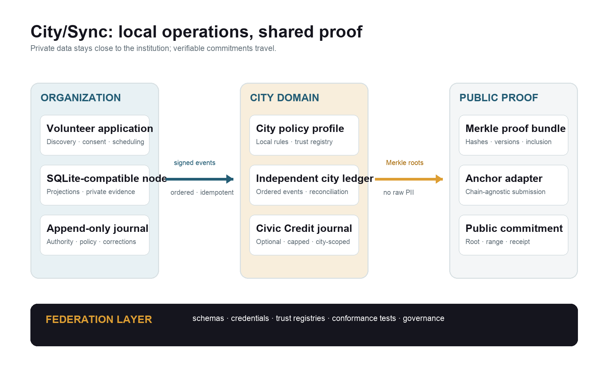
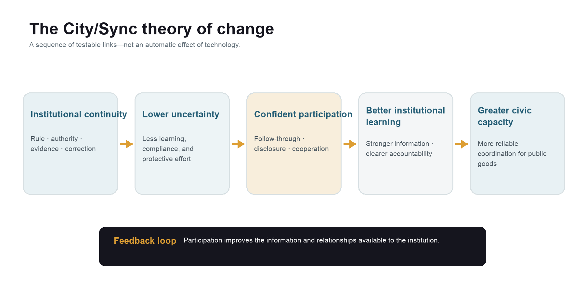

# City/Sync

## Distributed Institutional Infrastructure for Civic Capacity, Verifiable Public Administration, and Local Public-Goods Economies

**Whitepaper v1.0**  
**August 2026**

> City/Sync begins with a practical claim: public institutions become easier to trust when the people inside and around them can understand the rules, see who had authority, follow commitments across time, and verify the record without surrendering privacy or due process.

---

## Abstract

Public administration depends on institutions carrying intention across time, people, organizations, and changes in leadership. Friction appears when that continuity breaks: rules become difficult to locate, authority becomes ambiguous, commitments become detached from their rationale, evidence becomes scattered, and corrections overwrite rather than clarify the history. These failures impose administrative costs on public servants and community organizations, but they also impose learning, compliance, and psychological costs on the people trying to participate in or benefit from public institutions. The result is more than inefficiency. Each uncertain interaction makes the institution feel slightly more arbitrary and makes future participation slightly riskier.

City/Sync is a nonprofit-first civic infrastructure project designed to test whether a different information and coordination architecture can reduce that uncertainty. It begins as a Volunteer Management Application because volunteer coordination is independently useful and institutionally revealing. A single service interaction requires discovery, consent, scheduling, credentials, delegated authority, completion evidence, verification, correction, and reporting. These are the same granular capabilities that recur throughout public administration. The application therefore serves as both a product and a bounded learning environment in which City/Sync can determine which forms of transparency, portability, and verification actually improve human behavior and institutional capacity.

The technical model combines local operational databases, append-only event journals, cryptographic hash chains, city-scoped ledgers, portable credentials, privacy-safe proof bundles, and periodic anchoring to a public blockchain. The public chain is a verification layer rather than the operational database. Most personal and administrative data remain under local custody. Cryptography can show that a committed record or policy version has not been silently altered; it cannot prove that an off-chain claim was true, that a discretionary decision was wise, or that an action was lawful. City/Sync therefore treats legitimate authority, correction, appeal, privacy, and human judgment as primary components of the architecture.

This design pursues selective decentralization rather than ideological decentralization. Independent nonprofits and cities retain legitimate control over their own operations while using common protocols to express identities, authority, policies, attestations, and proofs. Public institutions adopt the infrastructure through existing law and governance rather than being displaced by a parallel institution. As the volunteer application matures, the same event-to-evidence model can support nonprofit reporting, machine-readable policy packages, and bounded municipal workflows. Cities can eventually interoperate through shared schemas and verification methods without surrendering local sovereignty or forcing local civic credits into a global currency.

The hypothesis is deliberately modest and potentially consequential: even a small improvement in institutional dependability can change how people engage. When participation feels less risky, people can spend less energy protecting themselves from the process and more energy contributing to it. Repeated across organizations and over time, that change can increase civic capacity, improve the quality of institutional information, and create stronger incentives for reliable public behavior.

---

## Executive Summary

### The problem is institutional continuity

An institution is a method for carrying collective intention across time and across people. A public purpose becomes a rule; the rule shapes a decision; the decision gives someone authority or responsibility; the resulting work creates evidence; and that evidence informs a later decision. Meaning can disappear at every handoff. Many public-sector systems store the final transaction while losing the relationships that make the transaction intelligible: which policy applied, who was authorized to act, what evidence was considered, what commitment followed, and how a later correction changed the record.

This missing continuity creates friction on both sides of a public interaction. Staff reconstruct context from inboxes, spreadsheets, memory, and personal relationships. Residents and community organizations learn the process repeatedly, submit the same information, wait without knowing what is happening, and struggle to distinguish a formal rule from an informal workaround. Research on administrative burden describes learning, compliance, and psychological costs in citizen–state interactions, while current trust research connects public confidence to reliability, responsiveness, fairness, integrity, and openness.[3][1] City/Sync does not treat trust as a communications problem. It treats trustworthiness as an operational property that can be improved, observed, and tested.

### What distributed ledgers contribute

A conventional database is often the right tool for public administration. It is efficient, familiar, and capable of strong access controls and audit logs. A distributed ledger becomes useful under a narrower set of conditions: several independent parties need to rely on a common history; one operator should not be able to alter that history quietly; rules and authority must remain attributable over time; or a person needs a verified claim to move across institutional boundaries.

Blockchain technology contributes a public, independently operated commitment layer. NIST describes blockchains as tamper-evident and tamper-resistant rather than literally immutable, and the U.S. Government Accountability Office warns that blockchains can be overly complex when a small number of trusted users can solve the problem with conventional systems.[8][9] City/Sync adopts both insights. Local databases perform day-to-day work. Append-only event journals preserve institutional history. Merkle roots summarize private event batches. A public chain timestamps those roots and makes later rewriting detectable. The chain proves integrity and sequence; authorized people and institutions remain responsible for the truth, legality, and fairness of the underlying actions.

### Why City/Sync starts with volunteer management

Volunteer programs sit at a useful boundary between civic life and public administration. They involve independent organizations, public purposes, recurring coordination, eligibility rules, sensitive information, real obligations, and a need to account for completed work. At the same time, the stakes are bounded enough to permit iteration before the infrastructure is used for decisions affecting essential rights or benefits.

The first product must succeed without blockchain literacy, wallets, or civic credits. A nonprofit should be able to recruit volunteers, publish opportunities, manage onboarding and waivers, schedule and communicate, verify completion, issue a service record, and export a funder-ready report. A volunteer should be able to understand an opportunity, know what information is required, consent to its use, complete the work, correct an error, and carry a verified contribution record elsewhere. If City/Sync cannot reduce administrative work and uncertainty in this setting, the architecture has not earned expansion into government.

### Civic Credits as governed local recognition

Civic Credits are a later, optional layer built on verified contribution. They are conceived as city-scoped, non-transferable units that recognize eligible public-goods work and can be redeemed for locally authorized benefits. They are not a speculative asset, investment, wage, or universal measure of civic worth. The local economy they create is a governed circuit: communities identify useful work, authorized organizations verify contribution, local partners fund or provide benefits, and the ledger makes issuance and redemption accountable.

Incentives can alter the meaning of voluntary action, and evidence on extrinsic rewards is mixed. Some designs can crowd out intrinsic motivation, while recent timebanking research suggests that reciprocal systems may complement volunteering when they preserve autonomy, respect, and social purpose.[22] City/Sync therefore treats credit design as an empirical question. Credits remain behind explicit policy, legal, fiscal, equity, and operational gates. Essential services cannot depend on a credit balance; public employment cannot be displaced by unpaid labor; participation remains voluntary; and recognition must not become a ranking of human worth.

### From volunteer operations to compliance infrastructure

The ledger becomes more useful when it can generate evidence as a by-product of work. A completed volunteer shift can carry the policy version, consent record, qualification status, authorized verifier, completion evidence, and later corrections needed for reporting. The same pattern can support grant reports, board and audit packages, training compliance, and other bounded obligations.

City/Sync proposes a machine-readable policy package that exists alongside the controlling human-readable source. The package identifies jurisdiction, authority, effective period, applicability, required evidence, mechanical tests, discretionary decision points, retention, disclosure, and recourse. This approach is consistent with the OECD's Rules as Code work, which emphasizes official machine-consumable rules while also recognizing their limitations and institutional implications.[15] City/Sync uses executable rules for mechanical constraints and evidence routing. Human judgment remains explicit, attributable, and appealable.

### Adoption from outside, legitimacy from inside

Public-sector systems designed entirely inside one agency often inherit that agency's organizational boundary, procurement history, data silos, and centralized control model. A private platform that attempts to replace public authority creates the opposite failure: it may achieve technical coherence while losing democratic legitimacy, due process, and institutional adoption. City/Sync is designed between those poles.

The protocol is developed outside any single government so that it can prove interoperability, independent verification, and local operation across nonprofits. A city adopts it through existing legal and administrative authority. Public officials retain policy and decision rights; City/Sync supplies shared institutional primitives and a reference implementation. This is exogenous technical development joined to endogenous institutional change. The method is layering: begin with useful capacity, place it inside legitimate institutions, measure what changes, and expand only when the new layer improves the institution it serves. Scholarship on gradual institutional change supports the premise that piecemeal changes can accumulate into consequential changes in behavior and outcomes.[4]

### The target architecture

City/Sync separates operations, evidence, and public verification:

1. Each nonprofit uses an SQLite-compatible operational database and append-only organization journal, either managed by City/Sync or operated locally by a qualified organization.
2. Organization events are synchronized through an ordered, idempotent outbox to an independent city ledger. The city ledger is the local coordination and credit boundary.
3. Private payloads remain under organization or city custody. Public-safe event envelopes include hashes, scoped references, policy versions, authority references, and redaction classifications.
4. Event hashes are assembled into Merkle batches. Periodic roots are anchored through a chain-agnostic adapter to a suitable public blockchain.
5. A proof bundle lets an authorized person or independent verifier recompute the event chain, verify inclusion, confirm policy and authority versions, and locate corrections or disputes.
6. Identity and credentials follow a holder–issuer–verifier model aligned with W3C Verifiable Credentials, while public chains contain no raw personally identifiable information.[10]
7. Cities federate through protocol versions, trust registries, conformance tests, and common proof formats. Local policies, data, and civic-credit balances remain local by default.

The current City/Sync implementation already contains important parts of this path: a shared control plane, separate city ledger databases, append-only hash-chained events, transactional event creation, an ordered city outbox, city-scoped credit journals, Merkle anchors, identity and delegated authority services, and a public verification view. Organization-local ledger nodes, portable standards-based credentials, external anchoring, independent verification packages, and municipal policy modules remain target architecture.

### The standard for success

City/Sync succeeds only if it produces measurable public value. The first tests concern ordinary experience: less manager time spent coordinating and reporting; faster onboarding and verification; fewer ambiguous statuses; more successful corrections; greater volunteer follow-through; more portable, accepted service records; and more organizations able to cooperate without surrendering their local data. Later pilots can test reporting cost, policy consistency, audit preparation, dispute resolution, independent proof verification, and public understanding.

The human outcome is confidence calibrated by evidence. Even a small improvement matters because it reduces some of the uncertainty people carry into every interaction. The institution begins to feel a little less arbitrary and a little more dependable. That small increase in confidence can significantly change how people engage: they become more willing to contribute information, accept responsibility, cooperate with people they do not already know, and remain involved when something goes wrong. Over time, those behaviors can increase civic capacity and help institutions learn from the people they serve.

---

## Reading This Whitepaper

This document combines a public-administration thesis, a product strategy, and a technical architecture. Statements about the City/Sync codebase describe the prototype reviewed in August 2026. Statements labeled as target architecture, proposal, or future stage are design commitments subject to testing, governance, security review, legal analysis, and adoption. Civic Credits and public-chain settlement are later capabilities, not requirements for the initial product. The paper is not legal, tax, employment, securities, privacy, accessibility, procurement, or accounting advice.

**Project basis.** The whitepaper also synthesizes the City/Sync Volunteer Management Application codebase and internal planning documents reviewed in August 2026, including the public-administration framework, vision article, platform iteration roadmap, and L3/local-chain architecture roadmap. Product and architecture statements should be revalidated against the codebase and governance decisions before implementation or public procurement.

---

# Part I — The Institutional Case

## 1. Public Administration as a Problem of Continuity

Public administration is often described through organizations, programs, laws, and budgets. From the perspective of a person trying to use it, however, administration appears as a sequence of handoffs. A rule written in one place is interpreted in another. A decision is made by someone whose authority may be difficult to see. Evidence is collected by an organization that stores it under a different system. The outcome is reported later, often by people who were not present when the work occurred. Each handoff is necessary. Each also creates an opportunity for context to disappear.

Institutions solve a fundamental coordination problem: they allow people to act together across time without relying on personal familiarity. They preserve roles, expectations, commitments, and procedures as participants change. Institutional strength therefore depends partly on continuity between purpose and action. A dependable institution can answer a simple chain of questions: Which rule applied? Who had authority? What was decided? What evidence supported the decision? What commitment followed? What changed later, and why?

Many administrative systems answer fragments of this chain. A case-management database contains the current status. An email identifies who approved it. A policy document describes a general rule. A spreadsheet contains the number reported to a funder. A shared drive contains evidence. None of these tools is inherently defective. Friction arises because the relationship among them has to be reconstructed. Institutional memory becomes a human integration layer.

This reconstruction work is distributed unevenly. Experienced staff know where to look and whom to ask. Well-resourced organizations can assign people to compliance and coordination. Residents with time, language fluency, digital access, and institutional familiarity can navigate uncertainty. Everyone else pays through delay, repeated disclosure, lost opportunity, stress, or withdrawal. A systematic review of administrative-burden research describes these costs as learning, compliance, and psychological burdens and finds recurring associations between state-imposed barriers and those experiences.[3]

Friction also weakens the institution's ability to learn. When decisions and outcomes are detached from the rule and evidence that produced them, patterns become difficult to compare. A correction looks like inconsistency rather than adaptation. A staff departure becomes a loss of context. Oversight becomes retrospective reconstruction rather than continuous visibility. The same gaps that burden the public also reduce managerial capacity.

City/Sync begins from the proposition that many of these problems share a small set of underlying institutional primitives:

- **Rule provenance:** knowing which policy, version, jurisdiction, and effective period governed an action.
- **Authority:** knowing which person or organization was permitted to act, within what scope, and under whose delegation.
- **Commitment:** preserving the obligation created by an authorized action and the conditions under which it may be changed.
- **Evidence:** connecting a claim to its source, custodian, time, purpose, and quality without exposing more information than necessary.
- **Attestation:** distinguishing a person's claim from another party's authorized confirmation of it.
- **Correction and recourse:** changing a record through an attributable, reviewable process that preserves the earlier state.
- **Verification:** enabling an affected person or authorized outsider to reproduce the relevant integrity, authority, policy, and calculation checks.

These primitives do not define good government by themselves. They create the conditions under which people can understand what the institution did and hold it to its own commitments.

## 2. Trust, Trustworthiness, and the Value of Small Improvements

Trust is often treated as a public attitude that institutions should increase. City/Sync uses a narrower and more demanding frame: institutions should improve their trustworthiness, and people should have better evidence with which to decide how much confidence is warranted. This approach avoids asking people to trust systems that remain opaque or unreliable.

The OECD's current framework associates institutional trust with reliability, responsiveness, integrity, openness, and fairness. Its 2026 survey reports that, across participating OECD countries, 40 percent of respondents expressed high or moderately high trust in national government while 43 percent expressed low or no trust; local government and several service institutions tended to fare better.[1] The purpose of these figures is not to claim that a ledger can change national trust. It is to show that public confidence is connected to observable institutional behavior and to whether people feel heard, treated fairly, and able to understand what government is doing.[1][2]

City/Sync focuses on the uncertainty embedded in an individual interaction. A participant deciding whether to volunteer, disclose a credential, rely on a promise, or challenge an error is making a practical judgment about risk. Clear rules reduce uncertainty about expectations. Visible authority reduces uncertainty about who can make a commitment. Available evidence reduces uncertainty about what happened. Verification and correction reduce uncertainty about whether the institution can quietly change the story.

Even a small improvement matters because it reduces some of the uncertainty people carry into every interaction. The institution begins to feel a little less arbitrary and a little more dependable.

That small increase in confidence can significantly change how people engage. When participation feels less risky, people become more willing to contribute information, accept responsibility, cooperate with people they do not already know, and remain involved when something goes wrong. They spend less energy protecting themselves from the process. More of that energy can go toward participating in it.

Over time, this can create different incentives and social behavior. Reliability gains value when commitments can be checked. Responsible participation becomes easier to recognize when an action remains connected to its context. A dispute can begin from a shared record rather than competing memories. Better participation can improve the information available to the institution, and better information can make the institution more responsive. The potential effect is recursive: modest trustworthiness can enable participation, and participation can generate the knowledge and relationships needed for further institutional improvement.

The relationship should be tested rather than presumed. Research on procedural justice finds strong associations among perceived fairness, legitimacy, cooperation, and compliance, while also warning that causal claims about policy changes require more rigorous evidence.[23] City/Sync therefore treats trust as an outcome to be measured carefully through behavior, experience, and institutional performance—not as a marketing metric or an automatic consequence of transparency.

## 3. What Blockchains Add—and What They Cannot

### 3.1 The useful distinction between a database and a blockchain

A database is an organized system for storing and updating information under the authority of one operator or a coordinated administrative domain. A blockchain is a shared ledger whose entries are cryptographically linked and accepted under a validation and consensus process across a network. The important difference for City/Sync is not that a blockchain stores better data. It is that the integrity and order of a committed record can be checked outside the organization that created it.

NIST's terminology is precise: blockchains are tamper-evident and tamper-resistant. They are not absolutely immutable.[8] A sufficiently powerful network participant, a governance action, a contract upgrade, a compromised key, or a protocol failure may change what a system accepts. The practical guarantee comes from making alteration detectable and progressively harder, distributing validation, and exposing privileged changes.

City/Sync carries this distinction into public administration. A local database can update a volunteer's hours from eight to six. An append-only event journal can preserve that the original eight-hour entry existed and that an authorized correction later changed the recognized total. An externally anchored root can let an outsider verify that the earlier history was already committed before the correction. The technology does not decide whether six is the truthful number. It preserves the institutional path through which a claim, attestation, correction, and final state became intelligible.

### 3.2 Verification is not truth

Cryptographic verification answers bounded questions:

- Does this record match the digest that was previously committed?
- Was it included in a particular event batch?
- Was the event signed or submitted by a key associated with a recognized authority at that time?
- Which policy version was referenced?
- Does the calculation reproduce under that version?
- Was a later correction, dispute, or revocation recorded?

It does not answer whether the original attestation was honest, whether an inspector exercised sound judgment, whether the authority acted lawfully, whether the policy was just, or whether a person gave meaningful consent. W3C makes the same distinction for verifiable credentials: verification establishes authenticity and currency of an issuer's statement, not the truth of the encoded claim.[10] Public-sector architecture must preserve that boundary.

The source of truth for many public facts remains an accountable human or institution. City/Sync calls this the **attestation boundary**. On one side are mechanical operations that software can reproduce: time windows, caps, signatures, role scope, schema validation, arithmetic, and inclusion proofs. On the other are observations and judgments supplied by people or qualified systems. Good design does not pretend the boundary has disappeared. It records who crossed it, under what authority, with what evidence, and through what avenue for challenge.

### 3.3 Policy visibility is not individual veto

A cryptographic policy registry can show that a specific policy version existed, when it became effective, and which actions referenced it. It can reveal a later change and prevent a platform operator from silently substituting one version for another. That does not mean every policy may change only with the consent of every affected person. Legislatures, courts, agencies, boards, and contract parties have different lawful powers to change rules.

City/Sync therefore distinguishes **notice**, **acknowledgment**, **consent**, and **public authority**. The system can require consent where a relationship legally or ethically depends on it; record acknowledgment where notice is required; and preserve attributable authority where government may lawfully act without individual agreement. Cryptography strengthens visibility and provenance. Legitimate governance defines who may change the rule.

### 3.4 When blockchain is proportionate

The U.S. GAO concludes that blockchain may be useful where many participants do not necessarily trust one another, but overly complex where a few trusted users can rely on a conventional database.[9] City/Sync adopts a proportionality test. Distributed or public settlement is justified when it adds at least one of the following:

- independent verification across organizations;
- resistance to unilateral platform control;
- local operational independence and credible exit;
- portable, consent-based proofs;
- durable public commitments; or
- visible changes to policies and privileged authority.

Where one accountable operator can meet the need with strong audit controls, City/Sync should use an ordinary database. Where a durable history is needed, it should add an append-only event journal. Where outsiders need to detect rewriting without receiving private data, it should add external anchoring. Shared on-chain execution belongs only in workflows whose coordination and governance requirements justify its cost and complexity.

## 4. Selective Decentralization for Public Institutions

Decentralization is often discussed as a single property. Public administration requires a more exact vocabulary. City/Sync separates five dimensions:

| Dimension | Centralized form | City/Sync direction |
|---|---|---|
| Data custody | One platform holds all operational records | Organization- and city-bounded custody with exports, backups, and privacy controls |
| Execution | One service performs every state transition | Local operational execution; shared mechanical constraints only where justified |
| Verification | The operator's dashboard is the only account | Independent hash, signature, policy, and inclusion verification |
| Authority | Platform administrators inherit broad power | Scoped, revocable delegations tied to legitimate organizations and jurisdictions |
| Governance | One vendor changes schemas and policy silently | Versioned protocol governance, public change records, conformance tests, and local adoption |

City/Sync seeks distribution sufficient to reduce unilateral control and cross-institutional friction. It does not require anonymous validators to decide who may approve a municipal grant, certify volunteer hours, or administer an appeal. Those roles belong to accountable authorities. The architecture becomes decentralized where independent custody, verification, and governance improve public value.

This distinction also preserves local law and institutional requirements. A city may need public-records retention, accessibility, procurement controls, labor safeguards, elected oversight, and judicial review. A nonprofit may need safeguarding rules, funder restrictions, board authority, and confidentiality. Purely permissionless execution can conflict with these obligations. A federated, permissioned operational structure with public proof can distribute power while keeping legal responsibility visible.

The result is better described as **polycentric institutional infrastructure**: multiple centers of legitimate decision-making connected through common rules and verification. Elinor Ostrom's work showed that collective-action institutions can rely on layered rules, monitoring, and locally meaningful governance rather than a simple choice between centralized state control and privatization.[5] City/Sync translates that insight into software boundaries. Organizations retain authority over their programs; cities retain authority over local policy; shared protocols make the boundaries interoperable and checkable.

## 5. An Adoption Strategy for Endogenous Reform

Public institutions are path dependent. Their information systems encode laws, budgets, job classifications, procurement contracts, reporting relationships, historical compromises, and risk controls. Attempts to build parallel institutions often underestimate how many people and rights depend on those arrangements. Even a technically elegant replacement can fail because it lacks authority, continuity, adoption, or a credible transition path.

The opposite approach—asking each government to invent its own distributed architecture from the inside—has a different weakness. A system built within one hierarchy tends to reproduce that hierarchy. The agency remains the sole custodian, validator, and change authority because those are the structures available to it. Procurement rewards a bounded deliverable. Legacy integration favors the incumbent data model. Risk management favors centralized control. The result may be a better agency database while leaving cross-organizational verification and credible exit unsolved.

City/Sync's position is that the architecture should be developed outside any one government's control, proven through real use across independent community organizations, and adopted by government through existing authority. This provides a better starting condition: the protocol arrives with demonstrated interoperability, a working verifier, local data boundaries, and an operating community broader than the adopting agency. Government then decides where and how the capability is lawful and useful.

This arrangement does not outsource sovereignty to City/Sync. Public bodies retain lawmaking, budgeting, enforcement, adjudication, and public accountability. City/Sync supplies institutional middleware: common event schemas, authority primitives, policy manifests, credential formats, synchronization, proof construction, and reference software. A city should be able to replace the operator, export its data and proof history, and continue under the protocol or a compatible implementation.

The theory of change is gradual and endogenous. Scholarship on institutional change emphasizes that layering and conversion can alter institutions through cumulative adjustments rather than wholesale replacement.[4] City/Sync follows that path deliberately:

1. solve a real operational problem for community institutions;
2. preserve the evidence and rules already generated by that work;
3. prove that independent organizations can coordinate through shared primitives;
4. introduce the proven primitives into bounded public workflows;
5. measure whether behavior, burden, and institutional capacity improve; and
6. expand only where the evidence and legitimate authority support expansion.

The project gains legitimacy from adoption inside existing institutions and architectural independence from development across them. That combination is the core strategic advantage.

---

# Part II — The City/Sync Development Path

## 6. The Volunteer Management Application

### 6.1 Why this is the right place to begin

Volunteer coordination contains the structure of public administration in miniature. An organization publishes a need under specific terms. A person decides whether to participate and provides information for a defined purpose. The organization evaluates eligibility, assigns responsibility, coordinates time and place, confirms performance, handles an exception, and reports the result. The work crosses boundaries among an individual, an organization, funders or public partners, and sometimes multiple service sites.

This setting is demanding enough to expose institutional failures. A waiver can be detached from the version a participant saw. A coordinator can appear to have authority they were never given. A training credential can expire. A no-show can be recorded incorrectly. A service-hour claim can be confirmed by the wrong person. A funder report can aggregate numbers that cannot be traced back to the work. Each failure is manageable, yet each tests a primitive that becomes more important in government.

The setting is also useful without the broader infrastructure thesis. Volunteer-management capacity can improve recruitment, training, partnerships, and organizational use of volunteers; an Urban Institute evaluation of the NYC Civic Corps found that supported organizations reported stronger volunteer-management practices and benefits.[21] City/Sync does not need a speculative network effect to justify its first release. A single organization should gain durable value even if it is the first user in its city.

### 6.2 The minimum complete operating loop

The product should be judged by a complete cycle rather than a feature inventory. A nonprofit can create its organizational identity, delegate narrow staff roles, publish an opportunity, state eligibility and accessibility information, enroll a participant, preserve consent and waiver versions, communicate changes, record check-in and completion, verify the contribution, resolve an error, issue a service record, and export a report whose numbers can be traced to source events.

For the volunteer, the same loop should feel coherent. The person can discover what is expected, understand why information is requested, choose whether to share it, see the status of a commitment, receive timely changes, complete the work, inspect the resulting record, and request correction. A wallet, cryptocurrency balance, or knowledge of blockchains is never a prerequisite for participation.

One verified shift serves as the project's reference transaction. Its history connects:

`opportunity terms → participant claim → consent/waiver version → eligibility evidence → authorized approval → attendance/completion claim → authorized attestation → correction or dispute state → portable service record → report inclusion`

The importance of this transaction is not its technical complexity. It is the possibility of carrying meaning through every handoff without asking the volunteer or organization to reconstruct the story later.

### 6.3 Who benefits

Volunteers gain clearer expectations, fewer repeated disclosures, a correction path, and a contribution record that can be presented elsewhere with their consent. Nonprofits gain a usable operating system for coordination, scoped staff authority, better retention and communication, and reporting evidence generated during ordinary work. Funders and public partners gain reports with traceable provenance rather than unexamined totals. Cities gain a view of civic capacity that can be aggregated without centralizing every private record.

The benefit remains conditional on usability. An append-only ledger that forces staff into duplicate data entry increases burden. A credential that volunteers cannot understand weakens consent. A technically valid proof that a funder will not accept has little practical value. City/Sync must therefore design from field observation, instrument the operating loop, support mobile and low-bandwidth contexts, meet accessibility standards, and maintain non-digital alternatives for essential actions. WCAG 2.2 supplies the baseline for web accessibility, while field research must address needs that standards alone do not capture.[20]

### 6.4 The Volunteer Management Application as a laboratory

The application tests three connected hypotheses.

The **operational hypothesis** is that a unified workflow and event-derived evidence reduce coordination and reporting work. The **institutional hypothesis** is that clearer rules, authority, commitments, and correction make the process more dependable. The **behavioral hypothesis** is that reduced uncertainty increases follow-through, repeat participation, willingness to share relevant information, and cooperation across organizations.

The sequence matters. City/Sync first measures whether the product performs the administrative job. It then tests whether verification adds value beyond a conventional audit trail. Finally, it tests whether any increase in confidence changes behavior. The project should be willing to learn that a primitive is unnecessary, confusing, or better implemented conventionally. The Volunteer Management Application is valuable precisely because it can falsify parts of the larger theory before they are embedded in higher-stakes systems.

## 7. Civic Credits and Local Public-Goods Economies

### 7.1 Purpose

Civic Credits are intended to strengthen local capacity for public-goods provision by connecting verified contribution to locally governed recognition and benefits. The key word is **connecting**. City/Sync does not assume that every civic act should be priced or that altruism requires payment. It explores whether a visible, accountable reciprocal structure can help communities recognize work that is currently difficult to coordinate, sustain, or value.

The proposed economy is a circuit rather than a market. A city or authorized community governance process defines eligible activity. Approved organizations create opportunities and attest to completed contribution. Credits are issued under caps and policy. Local redeemers—public agencies, cultural institutions, transit partners, businesses, philanthropy, or nonprofit partners—offer benefits under explicit terms. Redemption consumes or retires the relevant credits, and the system reconciles the obligation. Value remains rooted in local commitments to public goods.

### 7.2 Proposed properties

For an initial controlled pilot, Civic Credits should be:

- city-scoped and non-transferable;
- issued only after an authorized, evidence-backed completion event;
- subject to organization caps and review periods;
- noncash and nonconvertible by default;
- separate from identity, credentials, voting rights, donations, and charitable receipts;
- redeemable only against an approved, funded catalog;
- reversible only through attributable compensating events and a defined dispute process; and
- usable without a cryptocurrency wallet or participant-paid transaction fee.

This design resists speculation and keeps the system legible. A credit balance represents recognition under a specific city policy. It does not represent legal tender, an investment claim, a wage, or a universal comparison of people's contributions. Cross-city conversion is unavailable by default because cities may define different eligible work, fiscal commitments, and public priorities.

### 7.3 Incentive design and human behavior

Incentives communicate meaning. A poorly designed reward can turn a civic relationship into a transaction, draw attention toward what is easiest to count, or privilege people who already have time and access. Research on motivation finds both crowding-out and crowding-in effects, depending on context and design. A 2025 quasi-experimental timebanking study found promising equity and participation effects without observed crowding out in its setting, while emphasizing that more rigorous evidence is needed.[22]

City/Sync should therefore use credits to reinforce autonomy, reciprocity, and public purpose. The unit should recognize a verified contribution without claiming to measure its moral worth. Programs should include community input, accessible opportunity design, transport or caregiving supports where feasible, and qualitative recognition alongside credits. Hard-to-fill activities may receive differentiated recognition only through a transparent policy with equity review, rather than an opaque algorithm.

### 7.4 Guardrails

Credits should never become a condition for emergency aid, due process, education, voting, basic municipal service, or another essential right. Volunteer activity should not substitute for paid public employees or evade wage, classification, safeguarding, or labor obligations. Organizations must not pressure clients or workers into volunteering. Participants need clear tax, benefits, and program disclosures where relevant. Redeemable benefits must be funded, accounted for, and honored under stated terms.

Before a pilot leaves a closed sandbox, the city needs a written issuance policy, legal and fiscal review, a defined benefit and funding source, participant disclosures, organization consent, fraud and reversal procedures, accessibility and equity review, reserve or liability treatment, support capacity, and independent ledger verification. If any gate is missing, City/Sync should remain at non-monetary recognition.

### 7.5 What success would mean

The first question is whether credits create net additional public-goods capacity rather than relabeling activity that would have occurred anyway. The second is whether they widen participation or concentrate benefits among people already positioned to volunteer. The third is whether they strengthen or weaken intrinsic motivation and community relationships. The fourth is whether organizations change their behavior—by creating better opportunities, verifying work promptly, and collaborating—because the shared system makes those actions more valuable.

Success would appear as increased completion of locally prioritized work, broader and more equitable participation, low fraud and dispute rates, reliable redemption, and stable or improved intrinsic motivation. Failure could appear as gaming, coercion, unpaid labor substitution, inequitable access, unfulfilled benefits, or attention diverted toward countable activity. City/Sync commits to measuring both.

## 8. From Operations to Machine-Readable Compliance

### 8.1 Compliance as evidence generated by work

Compliance often becomes a second administrative system layered on top of operations. Staff perform the work in one set of tools and later reconstruct it for a funder, auditor, board, regulator, or city. The reconstruction creates cost and weakens evidence because the report is separated from the events that produced it.

City/Sync's alternative is **event-to-evidence compliance**. Material actions produce structured events in the same transaction as the operational change. Each event identifies its source, actor or authority, policy reference, time, and privacy class. Reports are views over that history. A report total can be traced to its included events; a report version can be retained; and a later correction can generate a revised report without erasing the earlier submission.

The first compliance products should remain close to the Volunteer Management Application: operational evidence packs, grant and funder reports, board and audit exports, waiver and training histories, delegated-authority reports, and data-retention logs. Formal tax filings, legal determinations, screening decisions, and professional attestations remain with qualified providers and authorized officials.

### 8.2 The City/Sync Policy Package

City/Sync proposes a machine-readable policy package with a stable identifier and version. Each package contains:

| Policy element | Purpose |
|---|---|
| Authority and source | Links the executable representation to the controlling law, regulation, contract, grant term, or organizational policy |
| Jurisdiction and applicability | States which city, organization, program, role, or case the policy governs |
| Effective interval and version | Prevents later rules from being applied silently to earlier actions |
| Inputs and evidence requirements | Defines the facts or attestations required before a rule can run |
| Mechanical constraints | Encodes caps, deadlines, thresholds, schemas, and approval sequences |
| Discretionary decision points | Names the qualified role that must exercise judgment and the evidence/rationale to preserve |
| Outputs and commitments | Defines the state transition, notice, obligation, or report produced |
| Privacy, retention, and disclosure | Limits how data may be used, stored, and shared |
| Correction, exception, and appeal | Preserves lawful change, human review, and recourse |
| Tests and examples | Allows implementers and oversight bodies to compare interpretations |

The human-readable source remains controlling unless a competent authority establishes otherwise. The machine-readable package is linked to that source by identifier and hash. A compiler or policy service can transform selected mechanical provisions into validation rules, forms, workflow gates, and reporting mappings. Discretionary provisions produce tasks for authorized people rather than hidden scores.

This architecture follows the most useful lesson of Rules as Code: rulemaking and implementation should be connected earlier so that official machine-consumable forms can reduce repeated interpretation.[15] It also adopts the caution that code cannot contain the full meaning of law. Standards such as OASIS LegalRuleML can represent legal norms and their relationship to sources, while XBRL offers mature structures for machine-readable reporting and taxonomy versioning.[16][17] City/Sync should map to such standards where the domain warrants it, while keeping its initial policy package small and operational.

### 8.3 Automated reporting, bounded automation

Automated reporting reduces both compliance overhead and regulatory overhead when it makes evidence easier to assemble, validate, compare, and sample. An authorized reviewer can receive a manifest listing the report definition, policy versions, event range, data sources, exceptions, reviewer, export time, and proof root. Mechanical tests can flag missing approvals, expired credentials, inconsistent totals, or late events before submission.

The automation remains bounded. A report can establish that specific events were recorded under a defined process. It cannot establish that a program achieved every social outcome, that each attestation was honest, or that the reporting entity complied with every applicable law. Regulators and funders retain risk-based judgment, inspection, audit, and enforcement. City/Sync reduces reconstruction; it does not replace accountability.

### 8.4 Regulatory interoperability

Machine-readable reporting becomes more valuable when several institutions share definitions. A city can publish a policy package and reporting schema; nonprofits can map operational events once; funders can accept the common package; and oversight bodies can compare conformance without demanding a new spreadsheet from every organization. Versioned schemas make change visible and testable.

This is a direct response to the silo problem identified in GovTech research. The World Bank describes interoperability as central to whole-of-government coordination and responsive public sectors.[6] City/Sync extends that principle across the public–nonprofit boundary. Interoperability includes governance and semantics, not just APIs: participants need shared meaning for identities, authority, events, evidence, policy, status, and recourse.

## 9. Extension into Local Government

### 9.1 The expansion criterion

City/Sync should enter a government workflow only when the underlying primitives have demonstrated value, the lawful authority is clear, and distributed verification solves a real cross-institutional problem. A workflow is a strong candidate when several accountable parties contribute to a shared process, evidence is reconstructed repeatedly, policy versions matter, unilateral record control creates risk, and an affected person has a meaningful correction or appeal path.

The project should avoid beginning with coercive, rights-determining, or safety-critical decisions. Early municipal uses should be bounded, reversible, and observable. They should preserve existing service channels and legal remedies. A city's first adoption may use only scheduling, reporting, authority, and evidence features; public anchoring and credits remain optional.

### 9.2 A municipal exemplar

Consider a city-funded neighborhood resilience program operated by community organizations. The city establishes program terms and reporting requirements. An authorized official approves an organization's participation. The organization coordinates trained volunteers, records eligible work, and submits evidence. The city reviews milestones, accepts or questions the result, and releases the next commitment. Residents and oversight bodies receive an appropriate transparency view.

City/Sync would preserve the path from public purpose to administrative action: the policy version behind the award, the authority behind each approval, the credentials associated with sensitive roles, the evidence supporting completion, the commitments created by acceptance, and any later correction or dispute. Private volunteer and service-recipient details would remain under authorized custody. Public proofs would show that the committed process history had not been silently rewritten.

The exemplar matters because the same primitives can later support other domains without pretending they are identical. Grant administration, credential acceptance, procurement milestones, inspections, permits, and interagency referrals contain different legal and evidentiary standards. City/Sync supplies common infrastructure while each domain supplies its legitimate authority, policy, evidence, and recourse.

### 9.3 A city as an operating boundary

In City/Sync, a city is more than a label. It is a boundary for operational data, policy, credit accounting, keys and roles, stewardship, retention, export, and incident response. A person may have one platform relationship while using contextual identifiers in different cities. Their civic-credit balances do not merge automatically. A local organization does not gain authority in another city. A platform administrator does not inherit municipal decision rights.

This design supports local sovereignty and credible exit. A city can export its event history, policies, credentials issued under its authority, proof bundles, and operational projections. It can appoint a new operator or run a qualified local node. Shared standards remain available even if the commercial relationship changes. A city should never be told it owns its infrastructure if it cannot retrieve, verify, restore, and govern it.

### 9.4 Public value before infrastructure prestige

Local government does not need a blockchain to justify adopting City/Sync. The initial municipal package can coordinate volunteers and organizations, produce impact and compliance reports, and clarify delegated authority. External anchoring becomes relevant after the city and community partners have a stable event model and an identified verification audience. Dedicated chain infrastructure becomes relevant only after volume, governance, or independence needs justify it.

This sequencing protects the public institution from technology-led procurement. It also protects City/Sync from mistaking infrastructure deployment for institutional improvement. The measure remains burden reduced, commitments kept, participation widened, evidence improved, and recourse preserved.

## 10. A Federation of City Protocols

City/Sync's long-term network is not one global civic ledger. It is a federation of local institutional domains that share enough protocol to verify and cooperate. Each city maintains its legal and political authority, private data boundary, policy history, and civic-credit economy. Common standards allow a credential, organization identity, service record, policy reference, or proof bundle to be understood elsewhere.

Federation requires four shared layers:

1. **Protocol schemas** define canonical event envelopes, credential profiles, authority delegations, policy packages, corrections, and proof bundles.
2. **Trust registries** identify which institutions may issue which kinds of credentials or attestations under which jurisdictions and periods.
3. **Conformance infrastructure** provides test vectors, reference verifiers, schema registries, compatibility suites, and implementation profiles.
4. **Governance** manages versions, security disclosures, deprecations, intellectual-property commitments, and representation by cities, organizations, participants, and technical maintainers.

Interoperability does not imply universal acceptance. A credential issued in one city can be cryptographically verified in another, but the receiving institution decides whether the issuer and claim satisfy local policy. A service record can travel while sensitive evidence remains private. A civic-credit balance stays local unless two cities deliberately create and govern a conversion agreement. Portability carries proof; it does not erase jurisdiction.

The network can spread through reference implementations and local operating partners rather than a single centralized deployment. A new city begins with a city profile, operating sponsor, independent data domain, policy and stewardship package, trained administrators, verifier, backup and exit plan, and a measurable civic use. Local extensions can coexist with a shared core if they preserve compatibility and publish their profile.

This model aligns with the wider movement toward digital public infrastructure: foundational systems that support secure, trusted interactions and reusable services across society.[7] City/Sync's contribution is a civic operations and evidence layer focused on the public–nonprofit boundary, institutional continuity, and local public-goods capacity.

---

# Part III — Technical Architecture

## 11. Architecture Overview

City/Sync uses layered architecture because public administration contains different trust, privacy, and availability requirements. Operational work needs fast local transactions and rich private data. Institutional evidence needs append-only history and reproducibility. Cross-organizational coordination needs common schemas and authority. Public verification needs small, privacy-safe commitments. No single database or chain should perform all four jobs.

**Figure 1.** Target architecture. Private operational payloads remain within organization and city domains. Public chains receive only approved commitments and non-sensitive metadata.

### 11.1 The layers

| Layer | Responsibility | Primary trust boundary |
|---|---|---|
| Participant and organization applications | Discovery, forms, scheduling, communication, review, correction, reporting, accessibility | People must understand actions and consequences |
| Organization node | Operational projections, append-only source journal, local documents and evidence, outbox | Organization custody and scoped staff authority |
| City domain | City registry, organization membership, policy profiles, city event ledger, civic-credit journal, reconciliation | City-local governance and separation from other cities |
| Protocol and verification services | Canonicalization, schema registry, credential exchange, proof construction, independent verification | Shared semantics and reproducibility |
| Public commitment layer | Anchor roots, policy hashes, approved registries, optional later settlement | Independent timestamping and tamper evidence |
| Federation governance | Protocol versions, conformance, trust registries, incident coordination | Multi-stakeholder change authority |

### 11.2 Current implementation and target state

The August 2026 prototype uses a Next.js application, Drizzle ORM, and SQLite/libSQL-compatible storage. A control database manages platform identities, organizations, city registry, and access. Each launched city receives an independent ledger database containing hash-chained events, anchors, and city-scoped credit records. Material application mutations append events in the same transaction as operational projections. An ordered outbox delivers relevant events idempotently to the city ledger. Merkle roots can be created through an anchoring interface whose default implementation is local/stubbed and whose code contains a public-chain adapter seam.

The target architecture adds organization-local source ledgers, signed canonical envelopes, standards-aligned portable credentials, independent proof packages, real external anchoring, city-operated replicas, machine-readable policy services, and protocol federation. This distinction prevents the roadmap from being presented as production capability.

## 12. Organization-Local SQLite Ledgers

### 12.1 Why SQLite-compatible storage

Small community organizations need infrastructure that is inexpensive, understandable, exportable, and operable with intermittent connectivity. SQLite provides serializable ACID transactions and atomic commit in a compact file-based system.[13] It also has a clear concurrency boundary: one database file permits a single writer at a time, although it can serve multiple readers.[14] These properties make it appropriate for a bounded organization event source, provided City/Sync does not treat it as a shared multiwriter network database.

City/Sync should support two organization-node modes:

- **Managed local domain:** City/Sync provisions an isolated SQLite/libSQL-compatible database and keys for the organization, provides backups and monitoring, and exposes full export and restore.
- **Sovereign node:** a qualified organization or local operator runs the reference node, holds its operational database and evidence, and synchronizes signed event envelopes to the city domain under an operating agreement.

Both modes use the same protocol. “Local” refers to institutional custody and a bounded database domain, not necessarily a laptop under a desk. Deployment may use an encrypted device, a managed service, or a replicated SQLite-compatible platform. Encryption at rest is supplied by the operating environment or an approved encrypted SQLite distribution; it is not assumed from SQLite itself.

### 12.2 Journal and projections

Each organization database contains two classes of state. **Projections** represent the current operational view: active opportunities, claims, schedules, credentials accepted, completion status, and report indexes. The **event journal** represents the historical source: append-only events with sequence, type, actor authority, policy references, canonical payload digest, previous hash, and correction relationships.

A material mutation updates the projection and appends its event inside one database transaction. If either write fails, both roll back. The event journal therefore cannot lag silently behind the user-visible state. A transactional outbox record is created in the same transaction for every event eligible for city synchronization.

Deletion requires careful semantics. Private payloads may need to be removed or cryptographically erased under retention and privacy rules. The journal can retain a non-personal tombstone, hash, authority, and reason showing that an authorized deletion or redaction occurred. The public chain never becomes a reason to retain personal data unlawfully. City/Sync anchors commitments to data, not the data itself.

### 12.3 Append-only does not mean error-free

Events are never edited in place after commitment. Errors are handled through compensating events such as `COMPLETION_CORRECTED`, `CREDENTIAL_REVOKED`, `POLICY_SUPERSEDED`, or `EVENT_REDACTED`. Each compensation references the affected event, authority, reason code, evidence class, and appeal state. Current projections incorporate the correction; verification tools preserve the history.

This approach supports both institutional memory and lawful change. It rejects two bad extremes: silently rewriting the past and treating every mistake as permanently operative.

## 13. Canonical Events, Hash Chains, and Finality

### 13.1 Canonical event envelope

City/Sync's target protocol uses a privacy-safe envelope separate from its private payload. The envelope SHOULD contain:

| Field | Meaning |
|---|---|
| `schemaVersion` | Protocol version used to interpret and canonicalize the event |
| `eventId` | Globally unique, stable idempotency identifier |
| `cityId`, `orgId` | Contextual namespaces; never inferred from a global balance |
| `sourceSequence` | Monotonic sequence in the source organization journal |
| `citySequence` | Sequence assigned when accepted into the city ledger |
| `eventType` | Versioned semantic event name |
| `occurredAt`, `recordedAt` | Distinguishes effective action time from system acceptance time |
| `actorRef`, `authorityRef` | Pseudonymous actor and scoped delegation or office |
| `policyRefs` | Policy identifiers and versions in force |
| `subjectRefs` | Contextual, non-public identifiers or digests as permitted |
| `payloadHash`, `evidenceRefs` | Integrity references to private content and evidence |
| `previousHash` | Hash of the previous accepted event in the relevant chain |
| `redactionClass` | Rules for disclosure, retention, and proof construction |
| `correctionOf`, `disputeState` | Relationship to prior history and current recourse state |
| `signature` | Source signature or authenticated service proof where enabled |

Canonicalization is essential because hashing and signing must produce the same bytes across implementations. RFC 8785 defines a JSON Canonicalization Scheme for invariant serialization and repeatable cryptographic operations.[12] City/Sync should adopt JCS or a similarly precise versioned format, publish test vectors, and reject ambiguous inputs such as duplicate property names.

### 13.2 Hash construction

The target domain-separated event hash is:

`eventHashᵢ = SHA-256("CITYSYNC-EVENT-v1" || previousHashᵢ || JCS(envelopeWithoutSignatureᵢ))`

The source signs the event hash or a versioned signing preimage. The exact byte encoding, Unicode normalization assumptions, timestamps, and null handling must be specified. The current prototype uses a simpler SHA-256 construction over previous hash, type, timestamp, actor, and canonical payload. Migration requires a versioned mapping rather than a silent change.

EVM systems commonly expose `keccak256`, while City/Sync's local journals currently use SHA-256. A public contract can store a SHA-256 digest as `bytes32`, or the protocol can compute an explicit EVM commitment over the original digest. Both hashes and their preimages must be named. Substituting one algorithm without versioning would destroy reproducibility.

### 13.3 Finality vocabulary

City/Sync distinguishes:

- **recorded:** accepted into the source journal;
- **city accepted:** validated, sequenced, and appended by the city domain;
- **administratively verified:** required authority and evidence workflow completed;
- **anchored:** included in a root committed to an external chain;
- **reconciled:** downstream credit, redemption, or report effect checked against source events; and
- **disputed/corrected:** challenged or changed through a subsequent authorized event.

These states prevent “on chain” from being presented as synonymous with valid, lawful, final, or true.

## 14. Synchronization and Interoperability Between Local Ledgers

### 14.1 Ordered, idempotent delivery

Organization nodes do not share or concurrently write the same SQLite file. Each writes locally and submits events to the city domain through an outbox. Delivery uses stable event IDs as idempotency keys. The city records the source organization, source sequence, prior hash, validation result, and assigned city sequence. A retry of the same event returns the existing acceptance result rather than creating a duplicate.

For each source, the city accepts events in order. A gap leaves later events pending. A conflicting event with the same source sequence or previous hash creates a fork condition and is quarantined for operator review. This preserves local operation during outages while preventing silent divergence.

The current prototype already follows the essential outbox pattern and stops ordered delivery after a failure so that later city events cannot overtake an unresolved predecessor. The target protocol extends this behavior to signed organization nodes and publishes the reconciliation state.

### 14.2 Validation pipeline

Before an event enters the city ledger, the city domain validates:

1. schema and canonical form;
2. source identity and signature or authenticated channel;
3. organization membership and status;
4. source sequence and previous hash;
5. actor delegation and validity period;
6. referenced policy versions and applicability;
7. mechanical constraints, idempotency, and replay protection;
8. privacy classification and public-envelope safety; and
9. any required attestation or evidence status.

A rejected event remains visible to its source with machine-readable reasons and a human support path. A synchronization failure never silently creates a credit, completion, or report state.

### 14.3 Protocol interoperability

Interoperability occurs at the event and proof layer rather than through direct database access. Each implementation can choose its operational schema if it can produce conforming envelopes, credentials, policy references, exports, and proofs. Version negotiation identifies supported schemas. Compatibility profiles state which optional modules a city implements.

The protocol registry includes semantic definitions, JSON Schemas, JCS test vectors, signature suites, credential profiles, status lists, error codes, redaction classes, and example proof bundles. A conformance suite replays known events and expects identical hashes, validation results, and projections. This shared behavior matters more than using the same vendor database.

## 15. Merkle Anchoring and Public Verification

### 15.1 Why anchor rather than publish

Publishing operational events to a public chain would expose sensitive metadata, impose costs, complicate correction and retention, and force public infrastructure into ordinary workflows. City/Sync instead batches event hashes into a Merkle tree. The root is a compact commitment to every included event. An inclusion proof later shows that a specific event belonged to the batch without revealing unrelated events.

The protocol uses domain-separated leaf and node hashes, deterministic ordering, and an explicit rule for odd leaf counts. An anchor record includes city ID, event sequence range, root, hash-suite version, policy-registry digest, creation time, submitter authority, and prior anchor reference. Public metadata is reviewed under the redaction policy to avoid inference from timing or small batches.

### 15.2 Proof bundle

An exportable proof bundle contains:

- city and organization context;
- source and city event envelopes permitted for the verifier;
- event and chain hashes;
- Merkle root and inclusion path;
- anchor receipt and chain finality information;
- policy package hashes and human-readable source links;
- authority and credential status material valid at event time;
- correction, revocation, and dispute references;
- canonicalization and hash-suite versions; and
- a signed manifest with verifier instructions.

An independent verifier can recompute the event hash, walk the Merkle path, match the public anchor, inspect authority and policy versions, and identify subsequent correction. If the underlying evidence is private, the verifier sees only what its role and the participant's authorization allow. A public root proves commitment, not continuing availability; organization and city operators therefore retain export, archive, backup, and restoration obligations.

### 15.3 Chain selection

The anchor interface is chain-agnostic. The current prototype contains an integration point for Base, and an initial test may use an inexpensive EVM testnet. The long-range architecture roadmap separately evaluates an Arbitrum Orbit–aligned dedicated execution layer. These choices address different stages: a low-cost public chain can provide early anchor receipts, while a dedicated layer would provide later shared registries or settlement if scale and governance justify it.

Production selection requires an architecture decision record evaluating security and finality, independent verification, data availability, transaction and relayer cost, operational maturity, governance and upgrade risk, ecosystem tooling, jurisdictional concerns, and exit strategy. City/Sync must never allow a chain brand to become part of the institutional promise. Proof bundles and adapters should make migration possible.

## 16. Identity, Credentials, and Authority

### 16.1 Separate the person from the roles they hold

Identity in public administration is contextual. One person may be a volunteer, an organization coordinator, a city employee, a credential holder, and an authorized verifier. Combining those roles into one platform superuser creates both privacy and authority risk.

City/Sync separates:

- a **participant identity**, used by the person to manage their account and consent;
- **contextual identifiers**, used within a city or organization to reduce correlation;
- an **organization identity**, representing a legal or recognized institution;
- an **authority identity/delegation**, granting a person a narrow role for a period; and
- **credentials**, assertions made by qualified issuers about a subject.

The current codebase already models participant, organization, and delegated authority identities separately and allows delegation revocation. The target model adds portable cryptographic credentials and stronger key lifecycle management.

### 16.2 W3C-aligned credentials

W3C Verifiable Credentials 2.0 defines issuer, holder, verifier, and verifiable-data-registry roles and makes clear that a verifier decides whether an issuer and claim are fit for a purpose.[10] City/Sync should align service records, training claims, background-screening status, organization authority, and similar portable attestations with that model.

The credential contains the minimum claim needed: issuer, subject or holder binding, type, scope, issuance and expiry, status method, evidence or policy reference, and cryptographic proof. Sensitive source documents remain with the qualified provider or authorized custodian. The holder authorizes presentation to a receiving organization. The receiver applies its own policy and records acceptance or rejection without assuming the credential guarantees placement or safety.

Decentralized Identifiers can support portable keys and service relationships, but they are optional implementation tools rather than a user requirement. The W3C DID specification emphasizes key rotation, revocation, privacy by design, and keeping personal data out of public DID documents.[11] City/Sync should use pairwise or contextual identifiers where possible, minimize correlation, and avoid placing names or stable personal identifiers in public registries.

### 16.3 Key and account recovery

Most participants should not manage seed phrases or pay gas. City/Sync can begin with conventional secure authentication, MFA for privileged roles, managed signing services, and recoverable accounts. Higher-assurance organization and city roles can use hardware-backed keys, threshold approval, and documented key ceremonies. Key rotation and revocation events preserve continuity.

Recovery must distinguish authentication from authority. Recovering a personal account does not automatically restore a revoked organization delegation. Restoring a city operator key requires threshold governance and an incident record. Lost keys should never force the loss of a person's service history; custodial proofs and reissued credentials can preserve access under documented recovery policy.

### 16.4 Authority as a first-class primitive

Every material action references a delegation with scope, issuer, subject, role, permissions, start, expiry, status, and optional policy constraints. The system validates the delegation at the event's effective and recorded times. Privileged actions—role grants, policy changes, high-volume credit issuance, redactions, emergency pauses—require enhanced controls such as dual approval, step-up authentication, or a timelock.

Authority remains accountable even when keys are pseudonymous in public proofs. Authorized oversight can resolve the key reference to the responsible office or person under policy. Public transparency can show the office and action without publishing personal information unnecessarily.

## 17. Policy Execution and Compliance Services

### 17.1 Mechanical, evidence-dependent, and discretionary rules

The policy engine classifies every rule before automation:

- **Mechanical rules** can be evaluated from accepted data: deadlines, caps, role permissions, required fields, and arithmetic.
- **Evidence-dependent rules** become mechanical only after an authorized source supplies a fact: completion, inspection outcome, credential status, or document receipt.
- **Discretionary rules** require contextual judgment: exceptions, equitable treatment, risk assessment, reasonableness, and professional conclusions.

The engine executes the first category, routes and validates attestations for the second, and creates an attributable human decision task for the third. A user-facing explanation identifies which inputs and rule version produced a result. Discretionary decisions include a reason code or rationale appropriate to the domain and a recourse path.

### 17.2 Policy lifecycle

A policy package progresses through draft, review, approval, publication, effective, superseded, and withdrawn states. Approval is performed by the legitimate authority, not the platform vendor. Publication generates a stable package digest. Implementations run conformance tests before the effective date. Events reference the policy version that governed them. Emergency changes use a defined authority, duration, notice, and post-event review.

Human-readable and machine-readable forms are developed together where feasible. Differences are tracked as issues rather than hidden in code. A policy change can require new consent or acknowledgment for future interactions while preserving the version attached to past events.

### 17.3 Report manifests

Every generated report includes a manifest with report definition, organization and city scope, date and event ranges, source schema versions, included and excluded event classes, aggregation rules, exceptions, corrections, policy packages, preparer and reviewer authority, generation time, and proof root. The report itself may be PDF, spreadsheet, API response, XBRL instance, or domain format. The manifest makes its lineage portable.

Automated checks can validate internal completeness and consistency. A professional or authorized official remains responsible for certifications the law assigns to them. City/Sync should integrate with approved filing and reporting providers rather than claiming authority it does not possess.

## 18. Future City Settlement and Execution Architecture

### 18.1 The city ledger remains operational truth first

The city ledger is the authoritative operational record during the nonprofit-first and early municipal phases. Public-chain anchoring adds evidence that the history has not been rewritten. It does not move ordinary scheduling, personal data, messaging, waivers, or reports onto a chain.

If multiple city operators later need shared commitments without a single platform veto, City/Sync may introduce small on-chain registries. A minimal suite could include:

- `CityRegistry` for approved city identifiers, status, and operator-governance references;
- `EventAnchorRegistry` for city roots and event ranges;
- `PolicyRegistry` for approved policy digests and effective versions;
- controlled credit issuance or redemption modules only after a governed pilot; and
- governance and emergency controls with multi-party approval and transparent events.

Contracts store commitments and mechanical constraints, not raw personal data, free-form evidence, or discretionary decisions. They use idempotent references, least privilege, pause capability, strong tests, independent audits, and public privileged-action events. Single-key permanent administration is unacceptable for authoritative civic state.

### 18.2 Dedicated shared layer and local execution domains

A later City/Sync dedicated layer—currently explored through an Arbitrum Orbit–aligned roadmap—could coordinate city registries, policy commitments, and approved settlement. A city with justified transaction volume and local operating capacity might run a child execution domain that settles to the shared layer. The terminology and trust assumptions must remain exact: a city domain settling to a City/Sync L3 is conceptually an L4-like child, even if the public product name is “City Chain.”

This stage requires more than software. A local operator needs a named legal entity, budget, keys, monitoring, archive and recovery obligations, incident procedures, service levels, exit and handoff, and independent verification. Distribution without operating capacity merely distributes failure.

### 18.3 Data availability

Anchoring a root proves that a commitment existed; it does not guarantee that an authorized person can retrieve the underlying record years later. City/Sync therefore treats data availability as an institutional obligation. Early stages use private exports, independent archives where lawful, restore drills, and on-chain roots. A future rollup or data-availability committee would require public documentation of committee membership, thresholds, retention, monitoring, key rotation, and failure procedures.

The design chooses the least public data necessary for the verification audience. If public third parties need to reconstruct a non-sensitive state without trusting local custodians, stronger public data availability may be warranted. If only authorized auditors need private evidence, encrypted off-chain custody with public commitments is more proportionate.

## 19. Privacy, Security, and Resilience

### 19.1 Privacy architecture

City/Sync applies data minimization, purpose limitation, contextual identity, retention rules, role-scoped access, and privacy-safe proof design. The NIST Privacy Framework provides a useful risk-management vocabulary for complex data-processing ecosystems,[18] and W3C credential standards identify correlation, aggregation, storage, and disclosure risks that are especially relevant to portable civic histories.[10]

The primary rule is simple: no raw personally identifiable information, waiver content, screening report, private message, precise sensitive location, client record, or unredacted evidence belongs on a public chain. Hashing personal data does not automatically make it anonymous; predictable values and surrounding metadata can enable inference. Public envelopes use random or contextual references, batching, and approved metadata profiles.

Participants receive clear purpose and retention notices, a record of disclosures, controls for credential presentation, and a path to access and correct data. Public-records law, litigation holds, safeguarding duties, and other lawful retention obligations are handled by jurisdiction-specific policy. Privacy claims are never used to erase evidence unlawfully; audit claims are never used to retain private data indefinitely.

### 19.2 Threat model

| Threat | Consequence | Primary controls |
|---|---|---|
| False or collusive attestation | Unjustified service record or credit | Qualified issuer registry, separation of claim and verification, caps, anomaly detection, sampling, sanctions, recourse |
| Compromised privileged account or key | Unauthorized policy, authority, issuance, or redaction | MFA, hardware-backed keys, least privilege, rotation, threshold approval, monitoring, emergency revocation |
| Duplicate/replayed event | Double credit or inconsistent report | Stable event IDs, sequence checks, idempotency, outbox state, reconciliation |
| Source fork or offline conflict | Divergent organization histories | Previous-hash enforcement, quarantine, deterministic merge policy, operator review |
| Platform administrator abuse | Invisible cross-city access or rewriting | Scoped roles, city boundaries, append-only admin events, independent verification, access reviews |
| Data loss or operator exit | Proof without available evidence | Exports, backups, archive obligations, restore drills, stewardship transfer, open verifier |
| Public metadata correlation | Exposure of sensitive participation patterns | Contextual identifiers, batch-size policy, timing controls, minimal public metadata |
| Smart-contract defect or chain outage | Incorrect settlement or unavailable anchors | Minimal contracts, testing/audit, pause, multi-chain adapter, local fallback, delayed reconciliation |
| Governance capture | Protocol changes against public interest | Multi-stakeholder governance, public RFCs, conflict policy, timelocks, local adoption/exit |
| Incentive gaming or labor substitution | Distorted public-goods provision and harm | Policy caps, independent review, equity metrics, employment safeguards, pilot limits, suspension and appeal |

Security governance should align to the lifecycle in NIST Cybersecurity Framework 2.0: govern, identify, protect, detect, respond, and recover.[19] Every city and organization deployment needs an incident owner, severity model, communications plan, evidence handling, recovery objectives, and post-incident review. Backups are tested through restoration, not assumed from successful creation.

### 19.3 Graceful failure

Local operations continue during a public-chain outage. Events remain pending for anchoring and receive no false “anchored” status. Synchronization retries cannot duplicate issuance. A city can pause new credit issuance or redemption without preventing a volunteer from viewing existing service history. An organization can operate in a degraded field mode and reconcile check-ins later under an explicit offline policy.

Emergency powers are narrow and visible. A pause cannot rewrite history. A redaction preserves an attributable tombstone. A key replacement requires documented authority. Restoration conditions and a post-incident account are part of the control, not discretionary follow-up.

## 20. Governance and Accountability

### 20.1 Roles

City/Sync governance separates institutional authority from technical stewardship:

| Actor | Governs | Does not automatically govern |
|---|---|---|
| Participant | Consent, credential presentation, personal preferences, correction requests | Organization attestations or city policy |
| Organization | Opportunities, staff delegations, program rules, attestations, local evidence | Citywide credit policy or another organization's data |
| City/public authority | Local program policy, approved operators, city credit rules, public accountability | Another city's operations or protocol source code unilaterally |
| City/Sync steward | Shared software, security baseline, protocol releases, conformance, support | Statutory authority, discretionary public decisions, private local evidence by default |
| Protocol council | Core schemas, compatibility, deprecation, security coordination | Local adoption or lawful city policy |
| Independent verifier/auditor | Recompute proofs, assess controls, publish findings | Create or modify operational events |

### 20.2 Protocol change

Core changes move through public proposals, threat and privacy review, reference implementation, test vectors, conformance results, migration plan, approval, publication, and an effective period. Security fixes can use an expedited process with limited disclosure before remediation and full retrospective documentation. Breaking changes receive a new major version; cities choose when to adopt within defined support windows.

Governance representation should include local governments, nonprofits, participants, public-administration and legal expertise, privacy and security practitioners, accessibility advocates, and technical maintainers. Conflict disclosures and decision records are public. Funding arrangements must not grant silent control over standards.

### 20.3 Recourse

Every consequential status requires a correction and appeal path appropriate to its stakes. The interface shows the source, responsible organization, policy, reason, deadline, and escalation route. A challenge itself becomes an event, but private narrative and evidence remain restricted. The original record stays visible to authorized reviewers; current projections show the operative result.

Technical verification complements legal recourse. A person may prove that the displayed record does not match an anchor or that an expired authority acted. They may still need an organization grievance process, city appeal, ombudsman, regulator, or court to obtain a remedy. City/Sync must make those institutions easier to use rather than implying that code has replaced them.

### 20.4 Exit and anti-lock-in

Every city receives documented exports of operational data, canonical events, policy packages, credentials and status material, anchors, proof bundles, and configuration. The protocol and verifier use implementable public specifications. Operator contracts define handoff, deletion, archive, key transition, and continuity. A city can replace City/Sync as operator without losing the ability to verify its history.

This exit right is part of decentralization. Multiple servers controlled by one vendor do not create meaningful distribution. Local agency exists when institutions can understand, retrieve, verify, govern, and move their system.

---

# Part IV — Evaluation, Roadmap, and Limits

## 21. Research and Evaluation Agenda

### 21.1 Theory of change

**Figure 2.** The proposed causal path is a testable hypothesis, not an assumed effect. Feedback may strengthen or weaken each link.

City/Sync's theory of change can be stated compactly:

`institutional continuity → lower uncertainty and burden → more confident participation → better information and cooperation → greater civic capacity → more trustworthy institutions`

Each arrow requires evidence. Better records may reduce reporting time without changing trust. Credits may increase participation while narrowing who participates. Transparency may create information overload. Portable credentials may reduce repeated checks while increasing privacy risk. Evaluation must identify these tradeoffs.

### 21.2 Measures

The evaluation framework uses four levels:

| Level | Illustrative measures |
|---|---|
| Operational | Manager time per filled shift; onboarding time; time to verify completion; report preparation time; support volume; sync and proof failures |
| Participant | Status comprehension; perceived arbitrariness; correction success; repeat participation; consent comprehension; willingness to share relevant data |
| Organization/network | Volunteer retention; cross-organization credential acceptance; collaboration; reporting quality; independent verification; restoration success |
| Civic/institutional | Distribution of participation; completion of prioritized public-goods work; public confidence in the specific process; responsiveness to disputes; adoption without lock-in |

Credit pilots add issuance concentration, redemption reliability, benefit funding, gaming, dispute, labor substitution, crowding-out/crowding-in, and equity measures. Compliance pilots add cost per report, exception rates, reviewer time, error detection, semantic consistency, and regulator/funder acceptance.

### 21.3 Study design

Design partners establish a baseline before implementation. City/Sync records quantitative process measures and conducts interviews or surveys with staff and participants. Where feasible, phased rollout or matched comparison groups estimate change beyond general trends. Product telemetry is minimized, consented, and separated from public proof. Independent researchers should review measures and publish limitations.

Trust questions remain process-specific. The project should ask whether a participant understands and can rely on a particular workflow, not whether using City/Sync made them trust government in general. Longitudinal research can later test whether repeated dependable interactions produce broader effects.

### 21.4 Evidence gates

Expansion requires evidence, not feature completion. A stage advances only when the current product is useful, stable, governable, and independently checkable. A failed hypothesis can remove a feature from the roadmap. This is especially important for incentives, identity portability, public anchoring, and automated policy, where technical feasibility can outrun institutional value.

## 22. Delivery Roadmap

### Phase 0 — Foundation and design partners (0–6 months)

City/Sync hardens the existing Volunteer Management Application, completes scheduling, communication, onboarding, accessibility, privacy inventory, monitoring, backup and restore, city provisioning, permission review, and baseline measurement. Three to five organizations run repeated live operating loops. Exit requires demonstrated weekly utility and no unresolved critical identity, authorization, or data-loss defects.

### Phase 1 — Nonprofit operating system and evidence (6–15 months)

The platform adds field-ready check-in, training and credential status, customizable forms and policy versions, report manifests, service records, incident safeguards, exports, APIs, multilingual workflows, and organization-level ledger isolation. Organization-local managed nodes and a reproducible journal verifier enter pilot. Exit requires measurable reductions in administrative work and accepted evidence exports.

### Phase 2 — City network and compliance pilot (12–24 months)

A city or regional partner adopts volunteer coordination without requiring credits or blockchain. City/Sync introduces common policy packages for a bounded reporting obligation, independent city-ledger verification, local operator runbooks, trust registry, and credential acceptance. Exit requires successful report use, low dispute rates, tested stewardship transfer, and an independent privacy/security assessment.

### Phase 3 — External integrity and controlled Civic Credits (18–30 months)

The platform anchors privacy-safe Merkle roots to a public testnet and then a selected production network after review. One city may run a private, city-scoped Civic Credit pilot with funded benefits, issuance caps, reconciliation, legal/fiscal review, equity evaluation, and a tested pause and correction process. External anchoring and credits remain separable workstreams. Exit requires reproducible proof, stable costs, reliable redemption, and no evidence of unacceptable harm.

### Phase 4 — Municipal institutional modules (24–42 months)

City/Sync introduces proven primitives into one bounded municipal workflow, such as the resilience-program exemplar. Machine-readable policy packages, delegated public authority, evidence manifests, public transparency views, and recourse are evaluated under existing law. Exit requires clear public value compared with a conventional architecture and positive review by the responsible institution.

### Phase 5 — Protocol federation (36+ months)

Additional cities adopt independent data domains and common conformance profiles. A multi-stakeholder protocol council, public schema registry, compatibility suite, independent verifiers, and operator certification support federation. Portable credentials expand where receiving institutions accept them. Civic-credit economies remain locally governed.

### Phase 6 — Dedicated settlement or city execution domains (conditional)

A shared dedicated layer or city child execution domain is considered only when transaction volume, multi-operator coordination, independence, and governance needs exceed the capabilities of anchored city ledgers. Entry requires audited contracts, sustainable operator budgets, public data-availability decisions, threshold governance, incident exercises, and a demonstrated benefit that cannot be achieved more simply.

## 23. Economic and Operating Model

City/Sync's early revenue and funding should align with operational utility: organization subscriptions or sponsored access, implementation and support, city network services, reporting modules, and grants or philanthropy for open protocol and evaluation work. Public-chain usage is an infrastructure cost, not a revenue thesis. Participant data is not an advertising asset, and sensitive identity or service information should never fund the platform through behavioral targeting.

Local Civic Credit programs need their own transparent fiscal model. The party promising a redeemable benefit must fund or supply it. Issuance creates a program commitment that should be reconciled against available benefits and disclosed under appropriate accounting treatment. Organization donations, platform fees, public funds, and credit balances remain separated.

The protocol's public-interest components—schemas, verifier, test vectors, export format, security advisories, and governance records—should remain accessible enough to make exit and independent implementation credible. Sustainable stewardship may combine open specifications, a reference implementation, certified services, and paid managed operations.

## 24. Limitations, Failure Conditions, and Open Questions

### 24.1 Limits of the architecture

City/Sync cannot make an institution fair merely by recording it accurately. A harmful policy can be executed transparently. An authorized official can make a poor judgment. A credential issuer can be wrong or corrupt. A public anchor can preserve evidence of a failure without remedying it. The project must therefore pair verification with governance, contestability, professional standards, and democratic accountability.

Distributed systems also create new burdens: key management, schema coordination, privacy risk, node operations, reconciliation, contract security, and governance complexity. A public chain may add cost without adding a meaningful verifier. Local custody may improve sovereignty while increasing variation in security capacity. Interoperability can spread a flawed standard quickly. Each benefit has a corresponding failure mode.

### 24.2 Conditions for stopping or redesigning

City/Sync should stop or substantially redesign a capability when:

- the conventional alternative produces equal public value with lower burden;
- volunteers or organizations must duplicate work to maintain the ledger;
- portable identity creates unacceptable correlation or exclusion;
- proof recipients cannot understand or use the verification;
- credits crowd out participation, displace labor, or concentrate access;
- machine-readable rules obscure discretion or conflict with controlling law;
- operators cannot meet security, archive, recourse, or exit obligations;
- public anchoring exposes sensitive metadata; or
- governance becomes effectively controlled by one vendor, city, funder, or key.

Stopping is not a failure of the research agenda. It is evidence that a primitive did not earn its complexity.

### 24.3 Open design questions

Several decisions should remain explicit rather than prematurely fixed:

- Which public chain best satisfies the anchor security, cost, governance, and exit criteria at production time?
- Which organization types need sovereign local nodes, and which are better served by managed isolated domains?
- Which credentials create enough portability value to justify privacy and issuer-governance costs?
- Which policy domains contain mechanical rules stable enough for machine-readable execution?
- How should community governance set Civic Credit priorities while protecting underrepresented residents?
- What evidence demonstrates that small increases in process confidence cause sustained participation rather than short-term satisfaction?
- Which protocol body can remain technically competent, publicly accountable, and resistant to capture across jurisdictions?

The whitepaper treats these questions as a governed research program, not missing implementation details.

## 25. Conclusion

City/Sync begins with an observation about institutions: collective purpose is lost less often at the moment it is declared than in the many handoffs required to carry it into action. Rules separate from decisions. Decisions separate from authority. Evidence separates from claims. Corrections separate from history. People and organizations compensate with memory, relationships, and repeated work. The institution continues, but it becomes harder to understand and riskier to enter.

Distributed ledgers offer a precise improvement. They can make a committed history independently checkable, preserve the relationship among rule, authority, event, and correction, and reduce the power of one operator to rewrite the record silently. They cannot supply truth, justice, legitimacy, or good judgment. Those remain institutional achievements. City/Sync's architecture is designed around that boundary.

The Volunteer Management Application is where the thesis becomes accountable. It must help organizations run better programs and help people participate with more confidence before the project asks a city to adopt anything larger. It turns identity, consent, authority, evidence, verification, and recourse into ordinary experiences with measurable outcomes. Civic Credits can later test whether verified contribution and reciprocal local benefits increase public-goods capacity without commodifying civic life. Event-derived reporting can test whether machine-readable policy reduces compliance work without hiding human discretion. Municipal pilots can test whether proven primitives improve real public workflows while preserving law and accountability.

The long-term network is a federation of cities and community institutions, not a replacement government and not one global database. Local domains retain authority, data, and civic context. Shared protocols allow them to cooperate and verify across boundaries. Public chains provide a limited commitment layer. Open exports, conformance tests, and independent verifiers create credible exit. Governance makes change visible and contestable.

The ambition is institutional, but the mechanism is incremental. Even a small improvement matters because it reduces some of the uncertainty people carry into every interaction. The institution begins to feel a little less arbitrary and a little more dependable. That small increase in confidence can change how people engage—how willing they are to contribute information, accept responsibility, cooperate with unfamiliar people, challenge an error, and remain involved when something goes wrong. Repeated across organizations and over time, those behaviors can create stronger civic capacity and institutions better able to learn, coordinate, and keep their commitments.

City/Sync exists to test whether that path is real, to build only what earns trust in practice, and to make the resulting institutional capacity available to cities without asking them to surrender the authority that makes public administration legitimate.

---

# Appendix A — City/Sync Institutional Decision Test

Before applying distributed infrastructure to a workflow, City/Sync asks:

1. **Administrative job:** What is the operational failure, who bears it, and what measurable improvement is sought?
2. **Rules:** Which parts are mechanical, evidence-dependent, or discretionary? Is the controlling source and version clear?
3. **Commitment:** Which authorized decision should become durable, and how may it be corrected, paused, or reversed?
4. **Data availability and privacy:** Who needs the evidence, for how long, under what authority, and what must remain private?
5. **Ability to check:** Which integrity, authority, policy, calculation, and inclusion claims can an affected person or independent verifier reproduce?
6. **Legitimate authority:** Who may attest, decide, administer, and change the rule?
7. **Recourse:** What notice, explanation, correction, appeal, and legal backstop exist?
8. **Local operation and exit:** Who runs, secures, funds, monitors, restores, and can replace the operator?
9. **Proportionality:** What public value does distribution add beyond a conventional database, standard, contract, or audit?

The architecture uses the least complex layer that passes the test.

# Appendix B — Minimum Public Proof Statement

A City/Sync verification result should state both what was proved and what was not:

> **Verified:** The disclosed event matches its canonical hash; its source chain is intact for the provided range; it is included in city anchor `[anchorId]`; the anchor matches public transaction `[receipt]`; the referenced authority and policy versions were active according to the disclosed registries; and no disclosed correction or revocation supersedes it as of `[time]`.
>
> **Not established by this proof:** the truth of private evidence, the honesty of the issuer, legal compliance, fairness, fitness for an unrelated purpose, or the absence of later undisclosed information. The verifier must apply its own policy and use the stated recourse channel.

# Appendix C — Glossary

**Anchor.** A public commitment, usually a Merkle root and metadata, recorded outside the operational ledger.

**Attestation.** An assertion made by an identified or accountable source under a defined authority.

**Civic capacity.** The ability of residents, organizations, and public institutions to discover needs, coordinate action, contribute, verify results, and learn together.

**Civic Credit.** A proposed city-scoped, non-transferable recognition unit issued under policy for verified public-goods contribution and redeemable only for approved local benefits.

**Commitment.** An obligation or durable state created by an authorized action, including the conditions for correction or reversal.

**Contextual identifier.** An identifier limited to an organization, city, relationship, or purpose to reduce unwanted correlation.

**Credential.** A set of claims made by an issuer about a subject and presented by or for a holder to a verifier.

**Event journal.** An append-only, ordered record of material actions and corrections from which operational state can be reconstructed.

**Institutional continuity.** The preservation of meaning and responsibility across the handoffs from purpose and policy to action, evidence, and later review.

**Merkle root.** A cryptographic digest committing to an ordered set of leaf hashes, allowing efficient inclusion proofs.

**Organization node.** A bounded SQLite-compatible operational and event-ledger domain serving one organization.

**Policy package.** A versioned machine-readable representation linked to a controlling human-readable source, including applicability, rules, evidence, authority, privacy, and recourse.

**Proof bundle.** The events, hashes, inclusion paths, policy and authority references, anchor receipt, and instructions needed for a permitted verifier to reproduce a claim.

**Projection.** A current operational view derived from events, such as an active schedule, balance, credential status, or report total.

**Selective decentralization.** Distribution of custody, execution, verification, authority, or governance only where it increases public value.

**Trust registry.** A governed record of which institutions or keys are recognized to issue particular credentials or attestations under defined scope and time.

**Verification.** Reproduction of defined integrity, authorship, status, policy, or calculation checks. Verification does not itself establish truth, legality, or fairness.

---

# References

[1] OECD. *OECD Survey on Drivers of Trust in Public Institutions 2026 Results*. OECD Publishing, 2026. https://www.oecd.org/en/publications/oecd-survey-on-drivers-of-trust-in-public-institutions-2026-results_9eb63fec-en.html

[2] OECD. *OECD Survey on Drivers of Trust in Public Institutions — 2024 Results: Framework and Drivers*. OECD Publishing, 2024. https://www.oecd.org/en/publications/oecd-survey-on-drivers-of-trust-in-public-institutions-2024-results_9a20554b-en/full-report/overview-new-trends-persistent-patterns-and-necessary-changes_f3abe0c7.html

[3] Madsen, Jonas Krogh; Mikkelsen, Kim Sass; and Moynihan, Donald P. “Administrative Burden in Citizen–State Interactions: A Systematic Literature Review.” *Journal of Public Administration Research and Theory* 34, no. 2 (2024): 180–195. https://doi.org/10.1093/jopart/muad023

[4] Mahoney, James, and Kathleen Thelen. “A Theory of Gradual Institutional Change.” In *Explaining Institutional Change: Ambiguity, Agency, and Power*. Cambridge University Press, 2010. https://doi.org/10.1017/CBO9780511806414.003

[5] Ostrom, Elinor. “Beyond Markets and States: Polycentric Governance of Complex Economic Systems.” Nobel Prize Lecture, 2009. https://www.nobelprize.org/uploads/2018/06/ostrom_lecture.pdf

[6] World Bank. “Interoperability: Towards a Data-Driven Public Sector.” GovTech Interoperability Working Group. https://www.worldbank.org/en/programs/govtech/interoperability

[7] World Bank. “Digital Public Infrastructure and Services.” https://www.worldbank.org/ext/en/topic/digital-and-ai/digital-public-infrastructure-and-services

[8] Yaga, Dylan; Mell, Peter; Roby, Nik; and Scarfone, Karen. *Blockchain Technology Overview*. NISTIR 8202. National Institute of Standards and Technology, 2018. https://doi.org/10.6028/NIST.IR.8202

[9] U.S. Government Accountability Office. *Blockchain: Emerging Technology Offers Benefits for Some Applications but Faces Challenges*. GAO-22-104625, 2022. https://www.gao.gov/products/gao-22-104625

[10] World Wide Web Consortium. *Verifiable Credentials Data Model v2.0*. W3C Recommendation, 15 May 2025. https://www.w3.org/TR/vc-data-model-2.0/

[11] World Wide Web Consortium. *Decentralized Identifiers (DIDs) v1.0*. W3C Recommendation, 19 July 2022. https://www.w3.org/TR/did-1.0/

[12] Rundgren, Anders; Jordan, Bret; and Erdtman, Samuel. *JSON Canonicalization Scheme (JCS)*. RFC 8785, 2020. https://www.rfc-editor.org/rfc/rfc8785.html

[13] SQLite. “SQLite Is Transactional” and “Atomic Commit in SQLite.” https://www.sqlite.org/transactional.html and https://www.sqlite.org/atomiccommit.html

[14] SQLite. “Isolation in SQLite.” https://www.sqlite.org/isolation.html

[15] Mohun, James, and Alex Roberts. *Cracking the Code: Rulemaking for Humans and Machines*. OECD Working Papers on Public Governance No. 42, 2020. https://doi.org/10.1787/3afe6ba5-en

[16] OASIS. *LegalRuleML Core Specification Version 1.0*. 2018. https://www.oasis-open.org/standard/legalrulemlv1-0/

[17] XBRL International. “The XBRL Specifications.” https://www.xbrl.org/the-standard/what/specifications/

[18] National Institute of Standards and Technology. *NIST Privacy Framework: A Tool for Improving Privacy through Enterprise Risk Management*, Version 1.0, 2020. https://www.nist.gov/privacy-framework/privacy-framework

[19] Pascoe, Cherilyn; Quinn, Stephen; and Scarfone, Karen. *The NIST Cybersecurity Framework (CSF) 2.0*. NIST CSWP 29, 2024. https://doi.org/10.6028/NIST.CSWP.29

[20] World Wide Web Consortium. *Web Content Accessibility Guidelines (WCAG) 2.2*. W3C Recommendation, 2023. https://www.w3.org/TR/WCAG22/

[21] Urban Institute. *NYC Civic Corps Program Evaluation*. 2018. https://www.urban.org/research/publication/nyc-civic-corps-program-evaluation

[22] Chan, Angelique W. M., et al. “Timebanking Promotes Equitable Volunteering in Older Adults without Crowding-Out Effects: Evidence from a Quasi-Experimental Study in Hong Kong.” *The Gerontologist* 65, no. 11 (2025). https://doi.org/10.1093/geront/gnaf200

[23] Nagin, Daniel S., and Cody W. Telep. “Procedural Justice and Legal Compliance.” *Annual Review of Law and Social Science* 13 (2017): 5–28. https://doi.org/10.1146/annurev-lawsocsci-110316-113310

---
